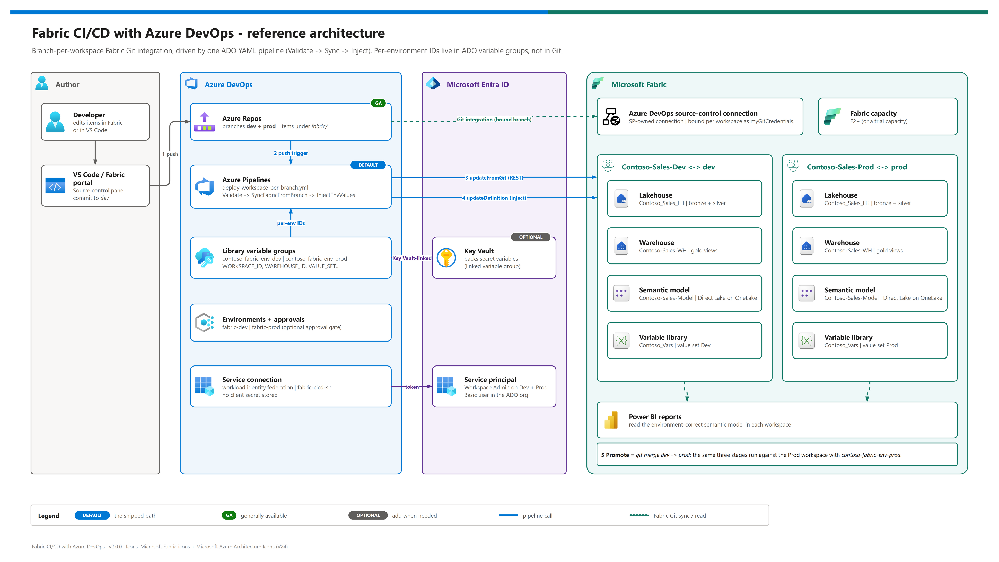
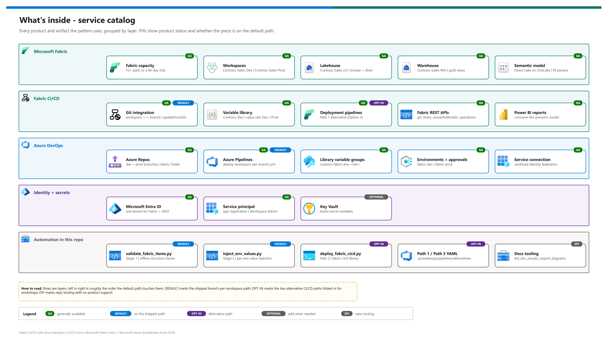
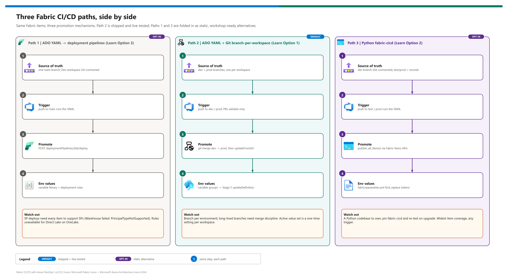

# Fabric Dev-to-Prod CI/CD with Azure DevOps

<p align="center">
  &nbsp;
  &nbsp;
  &nbsp;
  &nbsp;
  &nbsp;
  &nbsp;
  &nbsp;
  
</p>

<p align="center">
  
  
  
  
  
  
</p>

A reusable demo pattern for promoting **Microsoft Fabric** items (Lakehouse, Warehouse, a Direct Lake on OneLake semantic model and a variable library) between Dev and Prod workspaces with **Azure DevOps**. Each workspace is bound to its own Git branch, one ADO YAML pipeline validates, syncs and injects per-environment values, and a `git merge dev -> prod` is the whole promotion. It is for data platform engineers, Solution Engineers and architects who need to show, then adapt, a Fabric CI/CD setup that works under a service principal and solves the Direct Lake "rules are greyed out" problem. The example workload is a generic **Contoso Sales** model; retargeting it is a configuration change.

> Formerly published as `fabric-cicd-ado-integration`. Old links redirect automatically. Renumbered doc pages are mapped in [Moved documents](#moved-documents).
## At a glance

| | Item | Value |
|---|---|---|
|  | **Shipped path** | Path 2: ADO YAML + Fabric Git integration, one branch per workspace (Microsoft Learn Option 1). Live-tested in the originating engagement (2026-05). |
|  | **Pipeline** | [`deploy-workspace-per-branch.yml`](./.azuredevops/pipelines/deploy-workspace-per-branch.yml): Validate -> SyncFabricFromBranch -> InjectEnvValues. |
|  | **Per-environment values** | ADO variable groups `contoso-fabric-env-dev` / `contoso-fabric-env-prod`, never Git. |
|  | **Direct Lake answer** | Stage 3 rewrites the model's `WorkspaceId` / `LakehouseId` / `WarehouseId` M parameters per workspace through Fabric REST. |
|  | **Alternatives included** | Path 1 (deployment pipelines) and Path 3 (`fabric-cicd`) YAML + script, static-only, for workshops and edge cases. |
|  | **Workshop** | A 60-minute run of show, decision matrix and recovery plan in [12 - Workshop walkthrough](./docs/12-workshop-walkthrough.md). |

> [!NOTE]
> This README is the front door. To build the demo end to end, start with [`docs/00-reproduce-this-demo.md`](./docs/00-reproduce-this-demo.md). To decide which CI/CD path fits a team, read [`docs/07-cicd-paths-and-promotion.md`](./docs/07-cicd-paths-and-promotion.md).

## What this pattern delivers

-  Two Fabric workspaces (`Contoso-Sales-Dev`, `Contoso-Sales-Prod`) each bound to a Git branch (`dev`, `prod`) under `fabric/`.
-  One ADO pipeline that runs **Stage 1 Validate** on every PR and push, then **Stage 2 SyncFabricFromBranch** (`git/updateFromGit` + LRO poll) and **Stage 3 InjectEnvValues** (`getDefinition` / `updateDefinition`) on pushes to `dev` or `prod`.
-  Service-principal automation end to end: workload identity federation for the ADO service connection, a Fabric Azure DevOps source-control connection, and an idempotent `myGitCredentials` bind in the pipeline.
-  Per-environment IDs kept out of Git: the variable groups own them, and Git keeps only scaffolding values.
-  Two folded-in alternatives with a side-by-side comparison, so a workshop can cover all three Microsoft Learn options with one repo.

## Pattern at a glance

[](./docs/assets/fabric-cicd-ado-integration-architecture.png)

<sub>Editable source: [`docs/assets/fabric-cicd-ado-integration-architecture.drawio`](./docs/assets/fabric-cicd-ado-integration-architecture.drawio) - regenerate with `python scripts/export_diagrams.py docs/assets`.</sub>

## What's inside

[](./docs/assets/service-catalog.png)

<sub>Editable source: [`docs/assets/service-catalog.drawio`](./docs/assets/service-catalog.drawio) - regenerate with `python scripts/export_diagrams.py docs/assets`.</sub>

<table>
  <tr>
    <td align="center" width="25%"><br><b>Fabric workspaces</b><br><sub>Dev and Prod, each bound to one Git branch.</sub></td>
    <td align="center" width="25%"><br><b>Lakehouse</b><br><sub><code>Contoso_Sales_LH</code>, bronze + silver.</sub></td>
    <td align="center" width="25%"><br><b>Warehouse</b><br><sub><code>Contoso-Sales-WH</code>, gold views.</sub></td>
    <td align="center" width="25%"><br><b>Semantic model</b><br><sub>Direct Lake on OneLake with injected M parameters.</sub></td>
  </tr>
  <tr>
    <td align="center"><br><b>Variable library</b><br><sub><code>Contoso_Vars</code>, value sets Dev and Prod.</sub></td>
    <td align="center"><br><b>Azure Pipelines</b><br><sub>Validate, sync, inject; PRs validate only.</sub></td>
    <td align="center"><br><b>Variable groups</b><br><sub>Per-environment IDs, Key Vault-linkable.</sub></td>
    <td align="center"><br><b>Service connection</b><br><sub>Workload identity federation, no stored secret.</sub></td>
  </tr>
</table>

## Choose a CI/CD path

[](./docs/assets/cicd-paths-comparison.png)

| | Path | Promotion mechanism | Per-environment values | Service principal coverage | Status | Recommendation |
|---|---|---|---|---|---|---|
|  | **Path 2** - Git branch-per-workspace (Learn Option 1) | `git merge dev -> prod`, then `updateFromGit` | Variable groups -> Stage 3 | Every item the Git integration supports |   | **Default.** PR-driven teams; Direct Lake models; SP-only automation. |
|  | **Path 1** - deployment pipelines (Learn Option 3) | `POST deploymentPipelines/{id}/deploy` | Variable library + deployment rules | Only when every item in the request supports SPs |   | Teams already on deployment pipelines who want one `main` branch. |
|  | **Path 3** - Python `fabric-cicd` (Learn Option 2) | `publish_all_items()` via Fabric Items APIs | `fabric/parameter.yml` | Widest; code you own |   | Code-first teams, fan-out to many workspaces, items the others miss. |

> [!TIP]
> The paths combine. Microsoft's own guidance says many organisations take a hybrid approach - for example Path 2 for the Direct Lake model and Path 1 for reports. The full decision matrix is in [07](./docs/07-cicd-paths-and-promotion.md).

## Quick start

| Step | | Action | Gate |
|---|---|---|---|
| **0** |  | Authenticate to the right tenant (`az login --tenant`, `az account show`) | ☐ Tenant matches your Fabric tenant |
| **1** |  | Capacity + `Contoso-Sales-Dev` / `Contoso-Sales-Prod` workspaces ([02](./docs/02-prerequisites.md)) | ☐ Both on a capacity |
| **2** |  | Service principal, tenant settings, Fabric ADO connection ([11](./docs/11-service-principal-fabric-git-setup.md)) | ☐ `git/status` returns JSON as the SP |
| **3** |  | Variable groups + ADO environments, register the pipeline ([03](./docs/03-deployment.md)) | ☐ Pipeline saved, not run |
| **4** |  | Push to `dev`, then merge to `prod` | ☐ Three stages green twice |

> [!IMPORTANT]
> **No `azd up` here, by design.** This pattern creates Fabric items and Azure DevOps objects, not Azure Resource Manager resources, so the azd template rule does not apply. The pipeline is the one-command path. If you need a paid F-SKU capacity, create it once in the portal or with your own IaC ([02](./docs/02-prerequisites.md)).

## Repository layout

`docs/` holds every narrative document; the root holds this README and scaffolding only.

<details><summary><b>Show the file tree</b></summary>

```
fabric-cicd-ado-integration/
├── .azuredevops/pipelines/
│   ├── deploy-workspace-per-branch.yml        Path 2 (shipped): Validate -> Sync -> Inject
│   └── alternatives/
│       ├── deploy-via-deployment-pipeline.yml Path 1 (optional, static-only, no trigger)
│       └── deploy-via-python-fabric-cicd.yml  Path 3 (optional, static-only, no trigger)
├── fabric/                                    Fabric items under Git integration
│   ├── Contoso_Sales_LH.Lakehouse/
│   ├── Contoso-Sales-WH.Warehouse/
│   ├── Contoso-Sales-Model.SemanticModel/     Direct Lake on OneLake; M params injected per workspace
│   ├── Contoso_Vars.VariableLibrary/          value sets Dev / Prod
│   └── parameter.yml                          Path 3 only (fabric-cicd find_replace)
├── scripts/
│   ├── validate_fabric_items.py               Stage 1
│   ├── inject_env_values.py                   Stage 3
│   ├── deploy_fabric_cicd.py                  Path 3
│   ├── requirements.txt / requirements-fabric-cicd.txt
│   └── export_diagrams.py, lint_doc_visuals.py, make_badges.py   docs tooling
├── tests/                                     offline unit, reusability, configuration, doc-visual tests
├── data/sales_orders_sample.csv               small synthetic sample
├── docs/                                      00-13 + assets/ (diagrams, icons, badges)
├── demo-ids.template.json                     ID template + the workload config block
├── .leak-patterns.example.txt                 template for the local leak scan
├── CHANGELOG.md
└── README.md
```

</details>

## Documentation map

| | Doc | Read it when |
|---|---|---|
|  | [00 - Reproduce this demo](./docs/00-reproduce-this-demo.md) | Building it from scratch (Parts A-J + checklist) |
|  | [01 - Architecture](./docs/01-architecture.md) | Explaining the design, or adapting it to another workload |
|  | [02 - Prerequisites](./docs/02-prerequisites.md) | Before anything: tenant settings, roles, capacity, cost |
|  | [03 - Deployment](./docs/03-deployment.md) / [03b - Manual](./docs/03b-manual-deployment.md) | Pipeline path / portal-only path |
|  | [04 - Testing](./docs/04-testing.md) / [05 - Troubleshooting](./docs/05-troubleshooting.md) | Proving it works / it doesn't |
|  | [06 - Direct Lake + variables](./docs/06-direct-lake-variables.md) | The core problem this pattern solves |
|  | [07 - CI/CD paths](./docs/07-cicd-paths-and-promotion.md) / [08 - ADO bridge](./docs/08-ado-bridge-guidance.md) | Choosing a path / migrating from "ADO connected but unused" |
|  | [09 - Semantic model changes](./docs/09-semantic-model-deploy.md) / [10 - Env injection](./docs/10-dynamic-env-injection.md) | Day-2 changes / Stage 3 internals |
|  | [11 - SP + Fabric Git setup](./docs/11-service-principal-fabric-git-setup.md) | One-time identity onboarding |
|  | [12 - Workshop walkthrough](./docs/12-workshop-walkthrough.md) | Presenting it in 60 minutes |
|  | [13 - Configuration reference](./docs/13-configuration-reference.md) | Changing any name, ID or behaviour |

## Moved documents

v2.0.0 (2026-10-07) renumbered the original docs to the standard demo layout. If you hold a link to an old path, use the new location below.

| Old path (before v2.0.0) | New location |
|---|---|
| `docs/01-direct-lake-variables.md` | [docs/06-direct-lake-variables.md](./docs/06-direct-lake-variables.md) |
| `docs/02-lakehouse-warehouse-promotion.md` | [docs/07-cicd-paths-and-promotion.md](./docs/07-cicd-paths-and-promotion.md) |
| `docs/03-ado-bridge-guidance.md` | [docs/08-ado-bridge-guidance.md](./docs/08-ado-bridge-guidance.md) |
| `docs/04-architecture-best-practices.md` | [docs/01-architecture.md](./docs/01-architecture.md) |
| `docs/05-semantic-model-deploy.md` | [docs/09-semantic-model-deploy.md](./docs/09-semantic-model-deploy.md) |
| `docs/06-dynamic-env-injection.md` | [docs/10-dynamic-env-injection.md](./docs/10-dynamic-env-injection.md) |
| `docs/07-service-principal-fabric-git-setup.md` | [docs/11-service-principal-fabric-git-setup.md](./docs/11-service-principal-fabric-git-setup.md) |

`docs/00-reproduce-this-demo.md` kept its path.

## Distribution and check-in

This repo is meant to be imported into an Azure DevOps project (or forked) and pointed at your own tenant.

- **Never commit populated IDs or secrets.** `demo-ids.template.json` is the committed template; copy it to `demo-ids.local.json` (gitignored) for your own reference. `.gitignore` also blocks `.env`, `.sp-secret.json`, `*.pem`, `*.key` and `.leak-patterns.txt`.
- **Pipelines never read the IDs file.** At run time every per-environment value comes from the ADO variable groups, and every credential comes from the service connection (workload identity federation) or a Key Vault-linked group.
- **Rename before you run.** Set the `serviceConnection` variable in each pipeline YAML to your ADO service connection name ([13](./docs/13-configuration-reference.md)).
- **Leak scan.** Copy `.leak-patterns.example.txt` to `.leak-patterns.txt`, list any customer or tenant names, and run `python tests/test_reusability_guards.py` before you publish a fork.

> [!WARNING]
> The `fabric/` folder is live Fabric Git content. Committed `WorkspaceId` / `LakehouseId` / `WarehouseId` values are placeholders; Stage 3 overwrites them in each workspace. Don't hand-edit them to real IDs - that is the drift Stage 3 exists to prevent.

## When to use this pattern

| Situation | Use this pattern? |
|---|---|
| Team wants PR-driven promotion of Fabric items with ADO | ✅ Path 2 as shipped |
| Direct Lake on OneLake model must follow each environment's data | ✅ Stage 3 is the answer |
| Team already runs Fabric deployment pipelines and wants minimal change | ⚠️ Start with Path 1, add Stage 3 for the model |
| One codebase deployed to many customer workspaces (ISV) | ⚠️ Path 3 with a workspace loop; see Learn Option 4 |
| GitHub instead of Azure DevOps | ❌ Pipelines and connection steps here are ADO-specific |

## Decision provenance

| | Record | Notes |
|---|---|---|
|  | Originating engagement | A customer Fabric DevOps + ADO CI/CD workshop (2026-05). Path 2 was built and run live there; customer-specific material stays in the owner's private notes, not in this repo. |
|  | v2.0.0 retrofit (2026-10-07) | Visual standard, renumbered docs, alternatives folded in, Learn accuracy pass. See [CHANGELOG.md](./CHANGELOG.md). |
|  | Locked decisions | Branch per workspace; values in variable groups; SP via workload identity federation; Stage 3 owns Direct Lake parameters. Rationale in [01](./docs/01-architecture.md). |

---

*Last updated: 2026-10-07*
