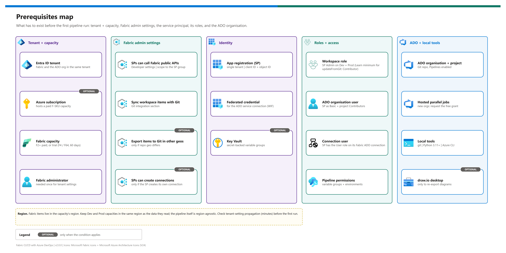

[README](../README.md) › [docs index](./00-reproduce-this-demo.md) › 02 Prerequisites

# 02 - Prerequisites

<p>
&nbsp;
&nbsp;
&nbsp;
&nbsp;
&nbsp;

</p>

  

Everything that must exist before the first pipeline run: the tenant and capacity, the Fabric admin settings, the service principal and its roles, the Azure DevOps organisation, local tools, regional alignment and an order-of-magnitude cost. It ends with a pre-flight checklist you can paste into a ticket. Share it with the Fabric admin and the ADO org owner up front - their approvals are the long poles.

## At a glance

| | Area | Long pole | Owner |
|---|---|---|---|
|  | Fabric tenant settings | Change approval + minutes of propagation | Fabric administrator |
|  | Hosted parallel jobs for a new ADO org | 2-3 business days | ADO org owner |
|  | App registration + federated credential | Entra permissions | Identity admin |
|  | Capacity | Azure subscription access (paid) or trial eligibility | Platform owner |

## Prerequisites map

[](./assets/prerequisites-map.png)

<sub>Editable source: [`assets/prerequisites-map.drawio`](./assets/prerequisites-map.drawio) - regenerate with `python scripts/export_diagrams.py docs/assets`.</sub>

## Tenant, subscription and capacity

| Resource | Requirement | Notes |
|---|---|---|
|  Microsoft Entra tenant | Fabric and the ADO organisation in the same tenant | The service principal must exist in both |
|  Azure subscription | Only for a paid F-SKU capacity (and an optional Key Vault) | Not needed with a trial |
|  Fabric capacity | F2 or larger, or a 60-day trial (provisioned as F4 or F64) | [Fabric trial](https://learn.microsoft.com/en-us/fabric/fundamentals/fabric-trial) |
|  Fabric administrator | Needed once for tenant settings | Can be delegated to a capacity/domain admin only for some settings |

> [!NOTE]
> No Azure Resource Manager resources are created by this pattern, so there is no Bicep or azd template. A paid capacity is created once, by hand or by your own IaC, and referenced by name.

## Fabric admin settings

Fabric Admin portal -> Tenant settings. Enable each and scope it to a security group that contains the service principal. Microsoft split the old *Service principals can use Fabric APIs* setting into two; only the first is required here ([developer settings](https://learn.microsoft.com/en-us/fabric/admin/service-admin-portal-developer)).

| Setting | Section | Required? | Status |
|---|---|---|---|
| **Service principals can call Fabric public APIs** | Developer settings | Yes |  |
| **Users can synchronize workspace items with their Git repositories** | Git integration | Yes (gates SPs too) |  |
| **Users can export items to Git repositories in other geographical locations** | Git integration | Only if the ADO org's geography differs from the capacity's |  |
| **Service principals can create workspaces, connections, and deployment pipelines** | Developer settings | Only if the SP creates its own Fabric connection or Path 1 pipeline |  |

> [!WARNING]
> Tenant settings take several minutes to propagate, and a setting scoped to a group the SP isn't in looks identical to a disabled one: `InsufficientPrivileges` on `git/status`. Confirm group membership before you debug anything else.

## Identity and roles

| Principal | Where | Role | Why |
|---|---|---|---|
|  Service principal | Both workspaces | **Admin** (Learn's minimum for `updateFromGit` is Contributor) | Sync + `updateDefinition`; Admin is what the originating build validated |
|  Service principal | ADO organisation | Basic access, project **Contributors**, repo Read | Fabric's clone inside `updateFromGit` runs as the SP |
|  Service principal | Its Fabric ADO connection | **User** | Required to bind the connection as `myGitCredentials` |
|  Federated credential | App registration | Issuer/subject from the ADO service connection | No client secret to rotate |
|  Your user | Both workspaces | Admin | Connecting a workspace to Git is a human, portal step |
|  Pipeline | Variable groups + environments | Pipeline permission | Avoids a first-run approval prompt |

Full onboarding: [11 - Service principal + Fabric Git setup](./11-service-principal-fabric-git-setup.md).

## Azure DevOps and local tools

| Tool | Version / setting | Used for |
|---|---|---|
|  Azure DevOps org + project | Git repo, Pipelines enabled | Repo, pipeline, library, environments |
|  Microsoft-hosted parallel jobs | at least 1 | Running the pipeline ([request](https://aka.ms/azpipelines-parallelism-request)) |
|  Python | 3.11+ (agent pins 3.11) | Validator, injector, tests |
|  Azure CLI + PowerShell 7 | current | Tokens and REST verification snippets |
|  draw.io desktop | optional | Re-exporting diagrams (`DRAWIO_EXE`) |

## Regional alignment

Fabric items live in their capacity's region; Azure DevOps organisations live in a geography chosen at creation. The pipeline itself is region-agnostic.

| Tier | Recommendation | When |
|---|---|---|
| **Tier 1** | Capacity and ADO organisation in the same geography; Dev and Prod capacities in the same region as the data they read | Strongly recommended |
| **Tier 2** | Different geographies, with *Users can export items to Git repositories in other geographical locations* enabled | Acceptable when the org is fixed |
| **Tier 3** | Trial capacity (created in the tenant's home region) for demos only; move to a paid capacity before production | Workaround |

| Component | Regional? | Check at deployment time |
|---|---|---|
|  Fabric capacity | Yes | Fabric Admin portal -> Capacity settings, or `GET /v1/capacities` (`region`) |
|  ADO organisation | Geography | Organization settings -> Overview -> Region |
|  Git integration | Follows capacity + org | Tenant setting above |

<details><summary><b>Show the verification commands</b></summary>

```pwsh
az login --tenant <TENANT_ID> --allow-no-subscriptions
az account show --query "{tenant:tenantId, user:user.name}" -o table
az rest --method get --resource https://api.fabric.microsoft.com `
        --url https://api.fabric.microsoft.com/v1/capacities `
        --query "value[].{name:displayName, sku:sku, region:region, state:state}" -o table
```

</details>

*Matrix published 2026-10-07 - verify at deployment time; capacity regions and settings move.*

## Cost estimate

| Item | Cost driver | Demo guidance |
|---|---|---|
|  Fabric capacity | F-SKU size x hours running | F2 is enough; pause when idle, or use a trial. [Fabric pricing](https://azure.microsoft.com/pricing/details/microsoft-fabric/) |
|  Azure DevOps | Users above the free tier; extra parallel jobs | The free grant covers this demo; check how your org bills the SP's access level |
|  Key Vault | Operations | Negligible; optional |
|  Power BI licences | Report authors | Per your tenant's licensing; not needed for the pipeline |

> [!TIP]
> Most of the cost is capacity hours. Stand the demo up on a trial or pause the F-SKU between sessions; nothing in the pipeline needs the capacity to be large.

## Pre-flight checklist

> [!NOTE]
> Paste this list into the change ticket you raise with the Fabric admin and the ADO org owner - it's the minimum they need to approve.

- [ ] Entra tenant, ADO org and Fabric in the same tenant
- [ ] Capacity (F2+ or trial) running; two workspaces assigned to it
- [ ] Fabric admin has enabled *Service principals can call Fabric public APIs* and *Users can synchronize workspace items with their Git repositories* for the SP's group
- [ ] App registration + federated credential created; SP added to the ADO org and project
- [ ] SP is Admin on both workspaces and User on its Fabric ADO connection
- [ ] ADO hosted parallelism granted (or a self-hosted agent registered)
- [ ] Python 3.11+, Azure CLI and git installed locally
- [ ] Regions checked against the matrix above

---

Next: [03 - Deployment](./03-deployment.md) →

*Last updated: 2026-10-07*
