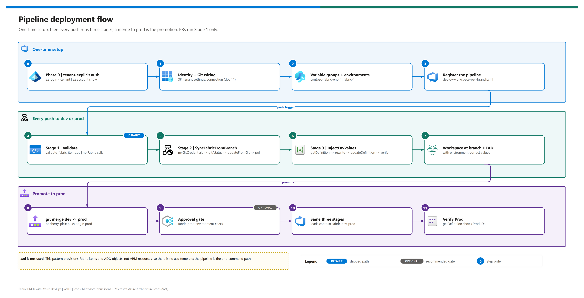

[README](../README.md) › [docs index](./00-reproduce-this-demo.md) › 03 Deployment

# 03 - Deployment

<p>
&nbsp;
&nbsp;
&nbsp;
&nbsp;
&nbsp;

</p>

   

How to deploy the shipped path - Path 2, branch per workspace - with the Azure DevOps pipeline, in numbered phases that each end with a gate you can tick. It assumes the [prerequisites](./02-prerequisites.md) are in place. Prefer to click through the portal with no pipeline or service principal? Use [03b - Manual deployment](./03b-manual-deployment.md). Building from zero end to end? [00 - Reproduce this demo](./00-reproduce-this-demo.md) orchestrates this page with the rest.

## At a glance

| | Phase | Outcome | Time |
|---|---|---|---|
|  | 0 - Authenticate to the right tenant | `az account show` matches your Fabric tenant | 2 min |
|  | 1 - Identity + Git wiring | SP can call `git/status` on both workspaces | 30-60 min |
|  | 2 - Variable groups + environments | Per-environment values in ADO | 15 min |
|  | 3 - Register the pipeline | Pipeline saved, triggers armed | 5 min |
|  | 4 - First run on `dev` | Three stages green | 5 min |
|  | 5 - Promote to `prod` | Prod model reads the Prod warehouse | 5 min |

## Fast path - the pipeline

[](./assets/pipeline-deployment-flow.png)

<sub>Editable source: [`assets/pipeline-deployment-flow.drawio`](./assets/pipeline-deployment-flow.drawio) - regenerate with `python scripts/export_diagrams.py docs/assets`.</sub>

> [!IMPORTANT]
> **Why there is no `azd up`.** The demo-pattern standard requires an azd template for every demo that provisions **Azure** resources. This one provisions Fabric items (through Git integration) and Azure DevOps objects (through the ADO portal or CLI), neither of which azd/Bicep manages, so the rule doesn't apply. Once Phases 0-3 are done, `git push` is the one-command deploy.

| Stage | | What it does | Owner script / task |
|---|---|---|---|
| **1 Validate** |  | Offline structure checks + changed-item list | `scripts/validate_fabric_items.py` |
| **2 SyncFabricFromBranch** |  | `myGitCredentials` bind, `git/status`, `updateFromGit`, LRO poll | inline `AzureCLI@2` (pwsh) |
| **3 InjectEnvValues** |  | Value set + model M parameters from the variable group; verify | `scripts/inject_env_values.py` |

## Phase 0 - Authenticate to the right tenant

> [!WARNING]
> Never run a bare `az login`. If you work across tenants, the ambient Azure CLI account drifts and REST checks quietly hit the wrong tenant. Log in to the tenant that owns Fabric and confirm it before every session.

```pwsh
az login --tenant <TENANT_ID> --allow-no-subscriptions        # add --use-device-code without a browser
az account set --subscription <SUBSCRIPTION_ID>                # only if you manage a paid F-SKU capacity
az account show --query "{tenant:tenantId, subscription:id, user:user.name}" -o table
```

- [ ] `tenant` matches the Fabric tenant; `user` is you (not a leftover service principal)

## Phase 1 - Identity and Git wiring

Follow [11 - Service principal + Fabric Git setup](./11-service-principal-fabric-git-setup.md) steps 1-7 and [00 Part D](./00-reproduce-this-demo.md#part-d---wire-the-workspaces-to-git) to bind each workspace to its branch.

| Step | | Action |
|---|---|---|
| **1.1** |  | App registration + federated credential; ADO service connection `fabric-cicd-sp` (workload identity federation) |
| **1.2** |  | Tenant settings for the SP's group; SP Admin on both workspaces; SP in the ADO org |
| **1.3** |  | Fabric ADO source-control connection (note its ID); bind `dev` / `prod` in the portal |

- [ ] `GET /v1/workspaces/{id}/git/status` returns JSON for **both** workspaces when run as the SP

## Phase 2 - Variable groups and environments

Create `contoso-fabric-env-dev` and `contoso-fabric-env-prod` in Pipelines -> Library with the variables below, authorise them for the pipeline, then create ADO environments `fabric-dev` and `fabric-prod`. Detail: [10 § 1-4](./10-dynamic-env-injection.md#one-time-setup).

| Variable | Dev example | Read by |
|---|---|---|
| `WORKSPACE_ID` | Dev workspace GUID | Stages 2 + 3 |
| `LAKEHOUSE_ID` / `WAREHOUSE_ID` | item GUIDs in Dev | Stage 3 |
| `WAREHOUSE_SQL_ENDPOINT` | `<dev-warehouse-sql>.datawarehouse.fabric.microsoft.com` | Stage 3 |
| `ENVIRONMENT_LABEL` / `VALUE_SET` | `Dev` / `Dev` | Stage 3 |
| `GIT_CONNECTION_ID` | Fabric connection GUID (optional) | Stage 2 bind step |

> [!TIP]
> Link the groups to Key Vault from day one if any value is sensitive. The pipeline reads linked and plain variables the same way, so switching later is invisible to the YAML.

- [ ] Both groups exist with identical variable names; `VALUE_SET` equals the value-set name exactly
- [ ] `fabric-dev` / `fabric-prod` exist and the pipeline has permission (optional approval on prod)

## Phase 3 - Register the pipeline

1. Set `serviceConnection` in [`deploy-workspace-per-branch.yml`](../.azuredevops/pipelines/deploy-workspace-per-branch.yml) to your service connection name. It must be a literal: `azureSubscription` is resolved at compile time.
2. Pipelines -> New pipeline -> Azure Repos Git -> this repo -> **Existing Azure Pipelines YAML file** -> `/.azuredevops/pipelines/deploy-workspace-per-branch.yml` -> **Save** (don't run).
3. Set the variable library's active value set per workspace ([10 § 5](./10-dynamic-env-injection.md#5-set-the-active-value-set-in-each-workspace)).

<details><summary><b>Show the trigger and group-selection YAML</b></summary>

```yaml
trigger:
  branches: { include: [dev, prod] }
  paths:    { include: [fabric/*, scripts/*, .azuredevops/pipelines/*] }
pr:
  branches: { include: [dev, prod] }
  paths:    { include: [fabric/*, scripts/*] }

variables:                        # inside Stages 2 and 3
  - ${{ if eq(variables['Build.SourceBranchName'], 'dev') }}:
    - group: contoso-fabric-env-dev
  - ${{ if eq(variables['Build.SourceBranchName'], 'prod') }}:
    - group: contoso-fabric-env-prod
```

</details>

- [ ] Pipeline saved; `serviceConnection` resolves; alternatives under `alternatives/` are **not** registered unless you adopt them

## Phase 4 - First run on dev

Push a change under a trigger path to `dev` (see [00 Part F](./00-reproduce-this-demo.md#part-f---first-run)). Expected log lines:

| Stage | | Expect |
|---|---|---|
| 1 |  | `Validated 4 Fabric items, no schema errors` |
| 2 |  | `workspaceHead` / `remoteCommitHash`, then `synchronized to commit <sha>` or `Already in sync` |
| 3 |  | resolved item IDs (redacted), `no-op` or `Updated definition`, `verification passed` |

- [ ] Three stages green; the Dev model shows the Dev IDs ([04 T4](./04-testing.md#t4---the-model-points-at-the-right-environment))

## Phase 5 - Promote to prod

```pwsh
git checkout prod
git merge dev --ff-only
git push origin prod
```

- [ ] Optional approval granted on `fabric-prod`
- [ ] Three stages green against `Contoso-Sales-Prod`; the Prod model shows the Prod IDs

> [!CAUTION]
> Don't edit items in the Prod workspace by hand. Stage 2 uses `PreferRemote`, so the next promotion overwrites them. Fix in `dev`, merge, push.

## Rollback

| Situation | | Action |
|---|---|---|
| Bad change reached Prod |  | `git revert <sha>` on `prod`, push - the same three stages restore the previous state |
| Stage 3 wrote wrong values |  | Fix the variable group, re-run the pipeline (idempotent) |
| Workspace diverged from the branch |  | Re-run Stage 2; `PreferRemote` makes the branch win |

---

Next: [03b - Manual deployment](./03b-manual-deployment.md) →

*Last updated: 2026-10-07*
