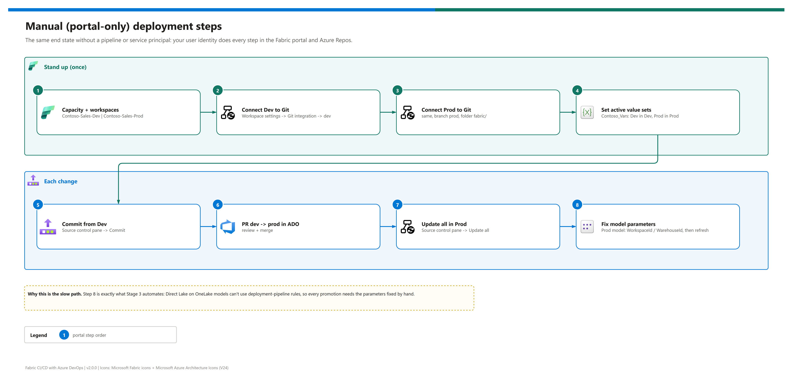

[README](../README.md) › [docs index](./00-reproduce-this-demo.md) › 03b Manual deployment

# 03b - Manual (portal-only) deployment

<p>
&nbsp;
&nbsp;
&nbsp;
&nbsp;
&nbsp;

</p>

  

The no-pipeline path: the same two Git-bound workspaces, promoted by hand in the Fabric portal and Azure Repos, with your own user identity and no service principal. Use it in a workshop where each step should be visible, when a tenant won't allow service-principal API access yet, or to understand exactly what the pipeline automates. The phases that don't provision anything (variable groups, the pipeline) simply don't exist here; everything else mirrors [03 - Deployment](./03-deployment.md).

## At a glance

| | Compared with the pipeline path | Manual path |
|---|---|---|
|  | Service principal, tenant API setting, Fabric connection | Not needed |
|  | ADO pipeline, variable groups, environments | Not needed (Azure Repos only) |
|  | Per-environment model parameters | Fixed **by hand** after every promotion |
|  | Repeatability | Depends on the operator; easy to forget a step |

## The steps

[](./assets/manual-deployment-steps.png)

<sub>Editable source: [`assets/manual-deployment-steps.drawio`](./assets/manual-deployment-steps.drawio) - regenerate with `python scripts/export_diagrams.py docs/assets`.</sub>

## Stand up once

| Step | | Portal action | Done when |
|---|---|---|---|
| **1** |  | Create or pick a capacity; create `Contoso-Sales-Dev` and `Contoso-Sales-Prod` on it (Workspaces -> New workspace -> License mode: Fabric capacity) | ☐ Both workspaces show the capacity |
| **2** |  | `Contoso-Sales-Dev` -> Workspace settings -> Git integration -> Azure DevOps -> org / project / repo, branch `dev`, folder `fabric/` -> Connect and sync | ☐ Four items appear, status Synced |
| **3** |  | Same for `Contoso-Sales-Prod`, branch `prod` (create it first in Azure Repos -> Branches -> New branch from `dev`) | ☐ Four items appear |
| **4** |  | Open `Contoso_Vars` in each workspace -> set the active value set (`Dev` / `Prod`) and fill in that workspace's IDs | ☐ Active set matches the workspace |

CLI equivalent for step 1 (paid capacity only), using your own login:

```pwsh
az login --tenant <TENANT_ID>
az account set --subscription <SUBSCRIPTION_ID>
az account show --query "{tenant:tenantId, subscription:id}" -o table
# Create the capacity in the portal (Create a resource -> Microsoft Fabric), or with your own IaC.
```

> [!NOTE]
> The Git connection in steps 2-3 uses **your** Azure DevOps identity. That's fine for a manual demo; the pipeline path swaps it for the service principal's `myGitCredentials` so nobody's personal access is in the loop.

## Each change

| Step | | Action | Done when |
|---|---|---|---|
| **5** |  | Edit in `Contoso-Sales-Dev`, then Source control -> Changes -> **Commit** | ☐ Commit on `dev` in Azure Repos |
| **6** |  | Azure Repos -> Pull requests -> `dev` -> `prod` -> review -> **Complete** | ☐ Merge commit on `prod` |
| **7** |  | `Contoso-Sales-Prod` -> Source control -> Updates -> **Update all** | ☐ Workspace at the new commit |
| **8** |  | Fix the Prod model's `WorkspaceId` / `LakehouseId` / `WarehouseId` (semantic model settings -> Parameters, or edit TMDL), then refresh | ☐ Report shows Prod data |

> [!WARNING]
> Step 8 is the whole reason the pipeline exists. Direct Lake on OneLake models can't use deployment-pipeline rules, so after **every** promotion the Prod model briefly points at whatever IDs were committed. Forget step 8 and Prod reports read Dev data.

## Alternative: deployment pipelines in the portal

If the team already uses Fabric deployment pipelines (Path 1), the manual equivalent of steps 5-7 is: Deployment pipelines -> your pipeline -> select items -> **Deploy** Dev -> Prod. Step 8 still applies to the Direct Lake model, and rules can't automate it. See [07 - CI/CD paths](./07-cicd-paths-and-promotion.md).

| | Step | Portal | Notes |
|---|---|---|---|
|  | Create pipeline | Workspaces -> Deployment pipelines -> Create | Assign Dev and Prod workspaces to stages |
|  | Deploy | Stage -> Deploy (select items) | Runs as your user, so Warehouse items deploy too |
|  | Fix model | as step 8 | No rules for Direct Lake on OneLake |

## Time delta vs. the pipeline path

| Activity | Pipeline path | Manual path |
|---|---|---|
| One-time setup | 1.5-3 h (identity is the bulk) | 30-45 min |
| Each promotion | about 2 min of waiting, zero clicks after the merge | 5-10 min of clicks per environment |
| Risk of drift | Low - Stage 3 rewrites values every run | High - depends on remembering step 8 |
| `demo-ids.local.json` | Copied into variable groups once | Fill in by hand and keep it open while you work |

> [!TIP]
> Run the manual path once in a workshop before showing the pipeline. Watching someone fix model parameters by hand makes Stage 3's value obvious.

## Verify

| Check | | How |
|---|---|---|
| Model IDs per workspace |  | [04 - Testing T4](./04-testing.md#t4---the-model-points-at-the-right-environment) reads the model definition and shows which IDs each workspace really uses |
| Active value set |  | Open `Contoso_Vars` in each workspace; Dev shows `Dev`, Prod shows `Prod` |
| Reports |  | A Prod report shows Prod rows after refresh |

---

Next: [04 - Testing](./04-testing.md) →

*Last updated: 2026-10-07*
