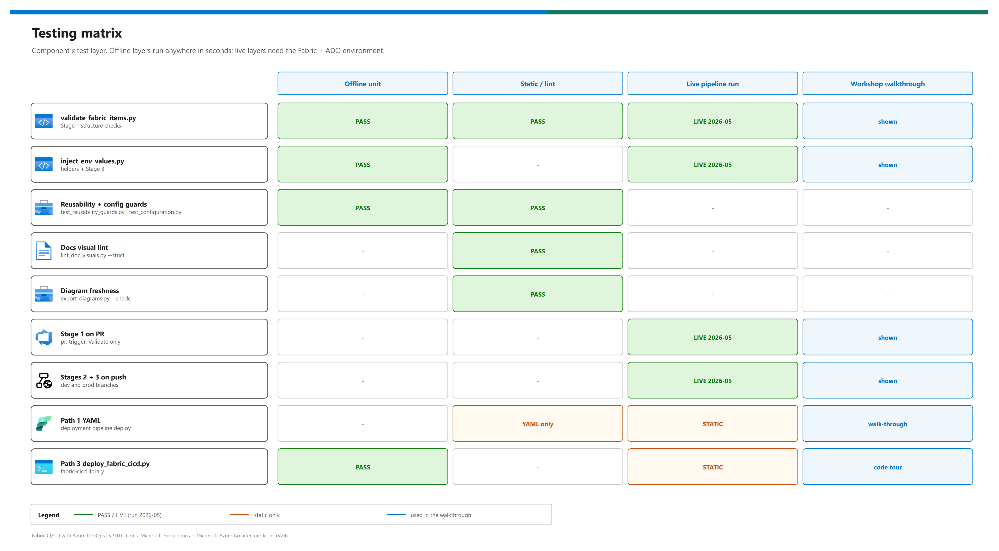

[README](../README.md) › [docs index](./00-reproduce-this-demo.md) › 04 Testing

# 04 - Testing

<p>
&nbsp;
&nbsp;
&nbsp;
&nbsp;
&nbsp;

</p>

  

How to prove the pattern works: offline tests that run anywhere in seconds, functional checks against a live tenant, a regression checklist for every change, and an honest record of what has and hasn't run live. Run the offline layer before every commit; run the functional layer after any change to identity, variable groups or the pipeline.

## At a glance

| | Layer | Runs where | Needs Fabric? | Status |
|---|---|---|---|---|
|  | Offline unit + guards | Laptop or Stage 1 agent | No |  |
|  | Docs + diagram checks | Laptop | No |  |
|  | Pipeline functional (T1-T6) | ADO + Fabric | Yes |  |
|  | Alternatives (Path 1, Path 3) | ADO + Fabric | Yes |  |

## Testing matrix

[](./assets/testing-matrix.png)

<sub>Editable source: [`assets/testing-matrix.drawio`](./assets/testing-matrix.drawio) - regenerate with `python scripts/export_diagrams.py docs/assets`.</sub>

## Offline tests

No network, no Fabric, no `pytest` required - every test file also runs as a plain script.

```pwsh
python tests/test_inject_helpers.py        # Stage 3 helpers: M-param rewrite, idempotency, base64, part lookup
python tests/test_scripts_offline.py       # Stage 1 validator + Path 3 script argument/config handling
python tests/test_reusability_guards.py    # workload block <-> items, defaults, YAML; no real GUIDs or org URLs
python tests/test_configuration.py         # every setting is in docs/13
python tests/test_doc_visuals.py           # lint_doc_visuals --strict + diagram PNG freshness
# or, with pytest installed:  python -m pytest tests
```

| Test file | Guards against | Status |
|---|---|---|
|  `test_inject_helpers.py` | Broken TMDL rewrite, double-replace, missing / duplicate parameter |  |
|  `test_scripts_offline.py` | Validator not honouring `SEMANTIC_MODEL_NAME` or missing an injected parameter; Path 3 arg parsing |  |
|  `test_reusability_guards.py` | Domain drift, leaked customer names (via local `.leak-patterns.txt`), real GUIDs, org URLs |  |
|  `test_configuration.py` | A new env var or pipeline variable that isn't documented |  |
|  `test_doc_visuals.py` | Bare docs, broken links/anchors, stale diagram PNGs |  |

> [!TIP]
> Stage 1 runs the validator on every PR. Add `python -m pytest tests` to that stage if your agents can install `pytest` - the suite takes seconds and needs no Fabric access.

## Functional tests (live tenant)

### T1 - Validator blocks a broken commit

Remove the `expression WarehouseId` line from `expressions.tmdl` on a branch and open a PR. **Expect:** Stage 1 fails with `missing expected M parameter`; Stages 2-3 never run.

### T2 - Sync reaches branch HEAD

Push a trivial change to `dev`. **Expect:** Stage 2 logs `workspaceHead` != `remoteCommitHash`, an operation ID, `status=Succeeded`, and `synchronized to commit <sha>`. Re-run: `Already in sync`.

### T3 - Injection is idempotent

Re-run the pipeline with no changes. **Expect:** Stage 3 logs `no-op (decoded content already matches)` for both items and makes no `updateDefinition` call.

### T4 - The model points at the right environment

<details><summary><b>Show the verification script</b></summary>

```pwsh
$token = az account get-access-token --resource https://api.fabric.microsoft.com --query accessToken -o tsv
$ws    = "<workspace-id>"
$h     = @{ Authorization = "Bearer $token" }
$sm    = (Invoke-RestMethod "https://api.fabric.microsoft.com/v1/workspaces/$ws/items?type=SemanticModel" -Headers $h).value |
         Where-Object displayName -eq 'Contoso-Sales-Model'
$def   = Invoke-RestMethod -Method POST -Headers $h `
         -Uri "https://api.fabric.microsoft.com/v1/workspaces/$ws/semanticModels/$($sm.id)/getDefinition?format=TMDL"
$part  = $def.definition.parts | Where-Object path -like '*expressions.tmdl'
[Text.Encoding]::UTF8.GetString([Convert]::FromBase64String($part.payload)) | Select-String 'expression (WorkspaceId|LakehouseId|WarehouseId)'
```

`getDefinition` can return `202` with a long-running operation for large models; poll `Location` if `definition` is empty.

</details>

**Expect:** the three IDs equal that environment's variable group, not the committed placeholders.

### T5 - Promotion

Merge `dev` -> `prod`. **Expect:** the optional approval prompt, three green stages against `Contoso-Sales-Prod`, and T4 showing the Prod IDs.

### T6 - Least privilege

Remove the SP's workspace role temporarily. **Expect:** Stage 2 fails with `InsufficientPrivileges`. Restore it; the next run is green.

> [!WARNING]
> Run T6 only in a demo tenant. Removing a role from the SP blocks every pipeline that uses it until you put it back.

## Regression checklist (every change)

| | Check | Command |
|---|---|---|
|  | Tests | `python -m pytest tests` (or the five scripts above) |
|  | Doc visuals | `python scripts/lint_doc_visuals.py --strict` - 0 errors |
|  | Diagram PNGs | `python scripts/export_diagrams.py docs/assets --check` - 0 stale (re-export after editing any `.drawio`) |
|  | Validator | `python scripts/validate_fabric_items.py` |
|  | Live | T2 + T3 + T4 on `dev` after any pipeline or script change; T5 before a workshop |

- [ ] All five rows pass before you merge to `prod`

## Live validation

| Check | Path | Result | Evidence |
|---|---|---|---|
| Git round-trip (workspace <-> `fabric/`) | 2 | ✅ 2026-05 | Items materialised from the branch in the originating build |
| Stages 1-3 on `dev` and `prod` pushes | 2 | ✅ 2026-05 | Pipeline runs and PR merges `dev -> prod` in the originating ADO project |
| `myGitCredentials` bind step | 2 | ✅ 2026-05 | Added after `GitCredentialsNotConfigured` on a new SP/workspace pair |
| Deployment pipeline Dev -> next stage (user context) | 1 | ✅ 2026-05 | About 30 s deploy in the portal |
| Deployment pipeline with the SP, Warehouse included | 1 | ❌ | `PrincipalTypeNotSupported` - why Path 1's YAML deploys Lakehouse + VariableLibrary only |
| Path 1 / Path 3 YAML from this repo | 1, 3 | ⏳ | Static only; adapted to this repo's names on 2026-10-07 |
| This v2.0.0 retrofit | all | ⏳ | Offline tests, lint and diagram checks only; no live re-run |

> [!IMPORTANT]
> Raw run logs aren't shipped - they contained tenant IDs. Before you present this as live-tested in a new tenant, run T2-T5 there and record the date in this table.

---

Next: [05 - Troubleshooting](./05-troubleshooting.md) →

*Last updated: 2026-10-07*
