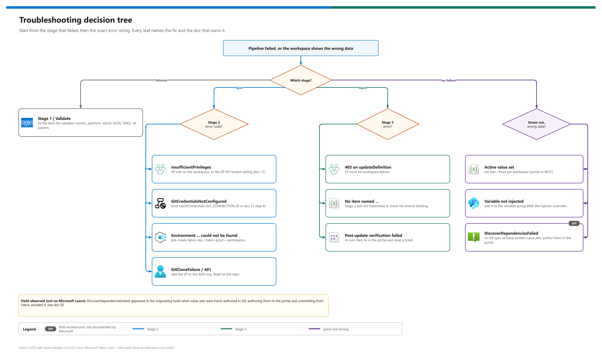

[README](../README.md) › [docs index](./00-reproduce-this-demo.md) › 05 Troubleshooting

# 05 - Troubleshooting

<p>
&nbsp;
&nbsp;
&nbsp;
&nbsp;
&nbsp;

</p>

 

What to do when a run fails or the workspace shows the wrong data. Start with the quick-triage table - it keys off the stage and the **exact** error string - then jump to the product section. Every fix links to the doc that owns the setup. Errors marked *field-observed* come from the originating build and aren't documented on Microsoft Learn.

## Quick triage

| Symptom (exact string) | Where | Root cause | Fix |
|---|---|---|---|
| `missing expected M parameter ...` / `defined N times` |  Stage 1 | `expressions.tmdl` hand-edited | Restore exactly one `expression <Name> = "..."` per parameter |
| `expected expressions.tmdl for SEMANTIC_MODEL_NAME=...` |  Stage 1 | Model folder renamed without the variable | Set `SEMANTIC_MODEL_NAME` or rename the folder back |
| `InsufficientPrivileges` on `git/status` |  Stage 2 | SP lacks a workspace role, or the API tenant setting isn't scoped to it | Workspace role; tenant setting ([11](./11-service-principal-fabric-git-setup.md)) |
| `GitCredentialsNotConfigured` |  Stage 2 | No `myGitCredentials` for this SP + workspace | Set `GIT_CONNECTION_ID` or run step 6 in [11](./11-service-principal-fabric-git-setup.md) |
| `GitCloneFailure` / 401 inside `updateFromGit` |  Stage 2 | SP isn't an ADO org user with repo Read | Add it (Basic + Contributors) |
| `400 InvalidParameter` on the `myGitCredentials` PATCH |  Stage 2 | Wrong connection ID/type, or SP has no role on the connection | Check type *Azure DevOps (source control)*; give the SP User |
| `Environment fabric-<x> could not be found` |  Stage 2 | ADO environment not pre-created / not authorised | Create it + pipeline permission ([10 § 4](./10-dynamic-env-injection.md#4-create-the-ado-environments)) |
| `Conflict` from `updateFromGit` |  Stage 2 | Uncommitted workspace edits that differ from the branch | Source control pane -> undo, or let `PreferRemote` win by re-running |
| `403 Forbidden` on `updateDefinition` |  Stage 3 | SP below Contributor on the workspace | Admin (as validated) |
| `No VariableLibrary item named 'Contoso_Vars'` |  Stage 3 | Item not materialised, or renamed | Check the branch binding; set `VARIABLE_LIBRARY_NAME` |
| `Ambiguous match: N SemanticModel items ...` |  Stage 3 | Duplicate items in the workspace | Delete or rename the duplicates |
| `Post-update verification failed` |  Stage 3 | Write accepted, value not observable | Re-run; then fix in the portal and raise a support ticket |
| Green run, Prod report shows Dev data |  Workspace | Active value set still `Dev` | Set it to `Prod` (portal or REST) |
| `DiscoverDependenciesFailed` on Git sync |  Git integration | Hand-authored value-set JSON (field-observed) | See below |
| Pipeline queued forever / "No hosted parallelism" |  ADO org | New org without the free grant | Request it, or use a self-hosted agent |

## Decision tree

[](./assets/troubleshooting-decision-tree.png)

<sub>Editable source: [`assets/troubleshooting-decision-tree.drawio`](./assets/troubleshooting-decision-tree.drawio) - regenerate with `python scripts/export_diagrams.py docs/assets`.</sub>

##  Stage 1 - Validate

Run the validator locally - it prints the same errors as the agent: `python scripts/validate_fabric_items.py`. It checks `.platform` manifests, that the variable library JSON parses (and each value set has a `variableOverrides` array), required TMDL files and `expressionSource` references, and the three M parameters Stage 3 rewrites (`WorkspaceId`, `LakehouseId`, `WarehouseId`).

> [!TIP]
> On Windows the scripts force UTF-8 output, so the ✓ / ✗ markers print instead of crashing a cp1252 console.

##  Stage 2 - Git sync

| Check | Command / place |
|---|---|
| Is the SP really the caller? | Pipeline log: `az account show` inside the task |
| Can it see the workspace? | `GET /v1/workspaces/{id}/git/status` as the SP ([11 § Verification](./11-service-principal-fabric-git-setup.md#verification)) |
| Is the workspace bound to the right branch? | Workspace settings -> Git integration |
| Is the tenant setting scoped to the SP's group? | Fabric Admin portal -> Developer settings |

##  Stage 3 - Inject

Run a dry run locally against the same workspace (reads everything, writes nothing):

<details><summary><b>Show the dry-run environment</b></summary>

```pwsh
$env:FABRIC_TOKEN         = az account get-access-token --resource https://api.fabric.microsoft.com --query accessToken -o tsv
$env:FABRIC_WORKSPACE_ID  = "<dev workspace id>"
$env:INJECT_VALUE_SET     = "Dev"
$env:INJECT_ENV_LABEL     = "Dev"
$env:INJECT_WORKSPACE_ID  = "<dev workspace id>"
$env:INJECT_LAKEHOUSE_ID  = "<dev lakehouse id>"
$env:INJECT_WAREHOUSE_ID  = "<dev warehouse id>"
$env:INJECT_WAREHOUSE_SQL = "<dev-warehouse-sql>.datawarehouse.fabric.microsoft.com"
$env:DRY_RUN              = "1"
python scripts/inject_env_values.py
```

</details>

A variable you added to the group but not to the injector's `overrides` map is silently ignored - see [09 - Add a variable](./09-semantic-model-deploy.md#add-a-variable-to-the-variable-library).

##  Variable library: DiscoverDependenciesFailed

> [!WARNING]
> **Field-observed, not documented on Microsoft Learn.** In the originating build, committing a variable library whose `valueSets/*.json` (per-environment overrides) had been **hand-authored** in Git made the Git sync fail with `DiscoverDependenciesFailed`. Reverting to a flat `variables.json`, creating the value sets in the Fabric portal, and letting Fabric commit them back to Git avoided the error. The value-set files in this repo were produced that way. If you add value sets, author them in the portal first and commit from the workspace; only then edit values in Git.

Microsoft's documented variable library failures (invalid names, wrong types, size over 1 MB, a missing active value set in a deployment target) are in [Variable library troubleshooting](https://learn.microsoft.com/en-us/fabric/cicd/variable-library/variable-library-troubleshoot).

##  Deployment pipelines (Path 1)

| Symptom | Cause | Fix |
|---|---|---|
| `PrincipalTypeNotSupported` when the SP deploys | Learn: an SP can deploy only when every item in the request supports SPs; Warehouse failed in the originating build | Deploy Warehouse with Path 2 or 3, or as a user |
| Model in Prod still reads Dev | Rules unavailable for Direct Lake on OneLake | Rewrite parameters (Stage 3 or `parameter.yml`) |
| Semantic model skipped by the deploy | Deployment pipelines dropped support for models without enhanced metadata (from 2026-02-12) | Keep models in TMDL / enhanced metadata format, as this repo does |

##  fabric-cicd (Path 3)

| Symptom | Fix |
|---|---|
| `fabric-cicd is not installed` | `pip install -r scripts/requirements-fabric-cicd.txt` |
| `Workspace '<name>' not visible to this identity` | Check `FABRIC_WORKSPACE_PREFIX`, the workspace role and the API tenant setting |
| GUIDs not replaced | `fabric/parameter.yml` must sit at the root of `repository_directory` (`fabric/`) and contain a block for `--target_env` |

## Escalation

| When | | Go to |
|---|---|---|
| A REST call returns `500` repeatedly, or verification keeps failing after a re-run |  | Fabric support ticket with the `requestId` from the error body |
| Service connection / federation errors |  | [Troubleshoot ARM service connections](https://learn.microsoft.com/en-us/azure/devops/pipelines/release/azure-rm-endpoint) |
| Tenant setting questions |  | Your Fabric administrator |

---

Next: [06 - Direct Lake + variables](./06-direct-lake-variables.md) →

*Last updated: 2026-10-07*
