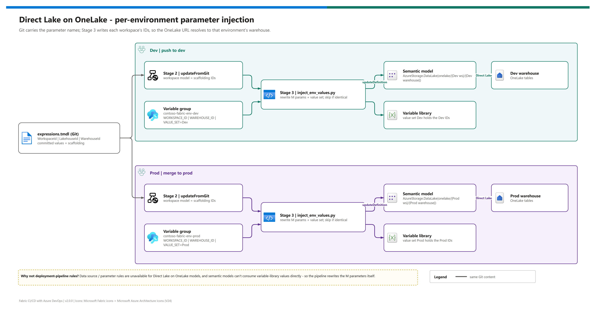

[README](../README.md) › [docs index](./00-reproduce-this-demo.md) › 06 Direct Lake + variables

# 06 - Direct Lake semantic models with per-environment sources

<p>
&nbsp;
&nbsp;
&nbsp;
&nbsp;
&nbsp;

</p>

  

The problem this pattern exists to solve, and how it solves it. A **Direct Lake on OneLake** semantic model reads its tables straight from OneLake by workspace and item ID. Those IDs differ between Dev and Prod, and the usual tools for swapping them per environment don't apply to this model type. This page shows the M-parameter pattern the repo ships and the pipeline step that rewrites the parameters on every promotion. It's the page to forward when someone asks "why can't we just use deployment rules?"

## At a glance

| | Question | Answer |
|---|---|---|
|  | Can deployment-pipeline rules swap the source? | No - data source and parameter rules are unavailable for Direct Lake on OneLake models. |
|  | Can the model read a variable library value? | No - semantic models aren't a supported variable library consumer. |
|  | What does work? | M parameters (`WorkspaceId`, `LakehouseId`, `WarehouseId`) in `expressions.tmdl`, rewritten per workspace. |
|  | Who rewrites them? | Stage 3 of the pipeline, from the branch's variable group, via Fabric REST. |

## The problem

Promote the model from Dev to Prod and its source expression still names the **Dev** workspace and warehouse, so Prod reports quietly read Dev data. The usual fixes don't reach this model type:

| Approach | Works for Direct Lake on OneLake? | Why |
|---|---|---|
| Deployment-pipeline data source / parameter rules | ❌ | Rules UI unavailable for this model type (open [Fabric idea](https://community.fabric.microsoft.com/idea/fbc_ideas/deployment-pipeline-deployment-rules-for-direct-lake-on-onelake-semantic-models/4678000)) |
| `{{VariableLibrary.var}}` in TMDL | ❌ | Semantic models aren't in the [supported consumer list](https://learn.microsoft.com/en-us/fabric/cicd/variable-library/variable-library-overview) |
| M parameters edited by hand after each promotion | ⚠️ | Works, but someone must remember every time ([03b step 8](./03b-manual-deployment.md#each-change)) |
| **M parameters rewritten by the pipeline** | ✅ | This repo's Stage 3 |

> [!IMPORTANT]
> The variable library has been generally available since September 2025 and is still useful here - notebooks, data pipelines, Dataflow Gen2 and shortcuts **can** read it, so it carries `environmentLabel` and the IDs for those consumers. It just can't drive the semantic model.

## How it works in this repo

[](./assets/direct-lake-parameter-injection.png)

<sub>Editable source: [`assets/direct-lake-parameter-injection.drawio`](./assets/direct-lake-parameter-injection.drawio) - regenerate with `python scripts/export_diagrams.py docs/assets`.</sub>

### Step 1 - parameters in `expressions.tmdl`

The model defines three text parameters and builds its OneLake source from two of them:

```tmdl
expression WorkspaceId = "11111111-1111-1111-1111-111111111111" meta [IsParameterQuery=true, Type="Text", IsParameterQueryRequired=true]
expression LakehouseId = "33333333-3333-3333-3333-333333333333" meta [IsParameterQuery=true, Type="Text", IsParameterQueryRequired=true]
expression WarehouseId = "55555555-5555-5555-5555-555555555555" meta [IsParameterQuery=true, Type="Text", IsParameterQueryRequired=true]

expression 'DirectLake - Contoso-Sales-WH' =
    let
        Source = AzureStorage.DataLake("https://onelake.dfs.fabric.microsoft.com/" & #"WorkspaceId" & "/" & #"WarehouseId", [HierarchicalNavigation=true])
    in
        Source
```

The committed values are **placeholders**. They matter only between `updateFromGit` and Stage 3 - a few seconds.

### Step 2 - per-environment values in ADO

| Variable group | Loaded for | Holds |
|---|---|---|
|  `contoso-fabric-env-dev` | pushes to `dev` | Dev workspace, lakehouse, warehouse IDs; SQL endpoint; label `Dev`; value set `Dev` |
|  `contoso-fabric-env-prod` | pushes to `prod` | the same names with Prod values |

### Step 3 - the pipeline rewrites them

After Stage 2 syncs the branch, `scripts/inject_env_values.py`:

| Step | | Action |
|---|---|---|
| **1** |  | Finds exactly one `Contoso_Vars` and one `Contoso-Sales-Model` by display name |
| **2** |  | Rewrites `valueSets/<set>.json` overrides from the group |
| **3** |  | Rewrites the three `expression` values (each must match exactly once) |
| **4** |  | Skips `updateDefinition` when the decoded bytes already match |
| **5** |  | Re-reads the model and fails if the values didn't stick |

### Step 4 - `environmentLabel` for everything else

The variable library also holds `environmentLabel` (`Dev` / `Prod`) and the IDs, so notebooks and pipelines can read them without knowing their workspace. Which value set is **active** is a per-workspace setting - set it once in the portal or with `PATCH /v1/workspaces/{id}/variableLibraries/{id}` and `{"properties": {"activeValueSetName": "Prod"}}` ([Update Variable Library](https://learn.microsoft.com/en-us/rest/api/fabric/variablelibrary/items/update-variable-library)). The pipeline keeps the contents current; it doesn't change the selection.

## Files

| File | Role |
|---|---|
|  `fabric/Contoso-Sales-Model.SemanticModel/definition/expressions.tmdl` | M parameter scaffolding |
|  `fabric/Contoso_Vars.VariableLibrary/` | `variables.json`, `settings.json`, `valueSets/Dev.json`, `valueSets/Prod.json` |
|  `.azuredevops/pipelines/deploy-workspace-per-branch.yml` | Validate -> Sync -> Inject |
|  `scripts/inject_env_values.py` | Stage 3 |
|  `scripts/validate_fabric_items.py` | Stage 1: the three parameters exist exactly once |

## Common pitfalls

- **Placeholders inside M.** `{{Contoso_Vars.x}}` in `expressions.tmdl` won't resolve; use parameters.
- **Direct Lake fallback.** Unsupported queries can still fall back to DirectQuery (Direct Lake on SQL) or fail (Direct Lake on OneLake); parameterising the source doesn't change that behaviour. See [Direct Lake overview](https://learn.microsoft.com/en-us/fabric/fundamentals/direct-lake-overview).
- **Adding a variable** takes four coordinated edits: `variables.json`, both value sets, both variable groups and the injector's `overrides` map ([09](./09-semantic-model-deploy.md#add-a-variable-to-the-variable-library)).

> [!CAUTION]
> Don't commit real IDs into `expressions.tmdl` "to make Dev work". The validator won't stop you, but the next Prod promotion will briefly serve Dev data and the diff will confuse every reviewer. Change the variable group instead.

## References

| Reference | Topic |
|---|---|
| [Variable library overview](https://learn.microsoft.com/en-us/fabric/cicd/variable-library/variable-library-overview) | Value sets, supported consumers |
| [Develop Direct Lake semantic models](https://learn.microsoft.com/en-us/fabric/fundamentals/direct-lake-develop) | Direct Lake on OneLake vs on SQL |
| [Semantic model definition](https://learn.microsoft.com/en-us/rest/api/fabric/articles/item-management/definitions/semantic-model-definition) | TMDL parts used by Stage 3 |
| [Create deployment rules](https://learn.microsoft.com/en-us/fabric/cicd/deployment-pipelines/create-rules) | What rules can and can't do |

---

Next: [07 - CI/CD paths and promotion](./07-cicd-paths-and-promotion.md) →

*Last updated: 2026-10-07*
