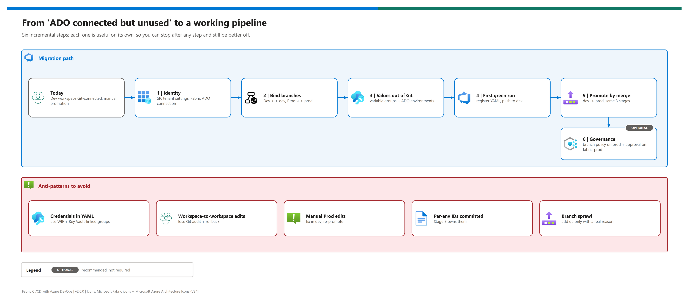

[README](../README.md) › [docs index](./00-reproduce-this-demo.md) › 08 ADO bridge guidance

# 08 - From "ADO connected but unused" to a working pipeline

&nbsp;
&nbsp;
&nbsp;
&nbsp;
&nbsp;

  

A common starting point: a Fabric Dev workspace is already connected to an Azure DevOps repo, but nothing else uses it - promotion is still manual clicks and per-environment values are fixed by hand after each move. This page is the incremental plan from there to the shipped pipeline, in six steps that each stand on their own, plus the anti-patterns to avoid on the way. It works as a customer-facing "next steps" handout after a workshop.

## At a glance

| | | Starting state | Target state |
|---|---|---|---|
|  | **ADO** | Connected to Dev via Git integration, otherwise inert | Drives promotion with [`deploy-workspace-per-branch.yml`](../.azuredevops/pipelines/deploy-workspace-per-branch.yml) |
|  | **Promotion** | Manual deployment-pipeline clicks or copy/paste | `git merge dev -> prod; git push` |
|  | **Per-environment values** | Hand-edited in each workspace after promotion | Injected by Stage 3 from variable groups |
|  | **Workspaces** | Dev / QA / Prod on one capacity, Dev bound only | Dev and Prod each bound to a branch (add QA the same way) |
|  | **Governance** | None enforced | Branch policy on `prod`; optional approval on `fabric-prod` |

## Migration path

Editable source: [`assets/ado-bridge-migration-path.drawio`](./assets/ado-bridge-migration-path.drawio) - regenerate with `python scripts/export_diagrams.py docs/assets`.

| Step | | Do | Value on its own | Detail |
|---|---|---|---|---|
| **1** |  | SP, tenant settings, Fabric ADO connection | Automation identity exists; no personal credentials in the loop | [11](./11-service-principal-fabric-git-setup.md) |
| **2** |  | Bind Dev <-> `dev`, Prod <-> `prod` | Every workspace is reproducible from Git | [00 Part D](./00-reproduce-this-demo.md#part-d---wire-the-workspaces-to-git) |
| **3** |  | Variable groups + ADO environments | Environment values live in one governed place | [10](./10-dynamic-env-injection.md#one-time-setup) |
| **4** |  | Register the YAML; push to `dev` | Validated, synced, injected Dev on every push | [03](./03-deployment.md) |
| **5** |  | Promote with a merge to `prod` | Reviewable, repeatable promotion | [03 Phase 5](./03-deployment.md#phase-5---promote-to-prod) |
| **6** |  | Branch policy on `prod` + approval on `fabric-prod` | Human checkpoint without changing the pipeline | below |

> [!TIP]
> Teams already on deployment pipelines can run steps 1-3, keep deploying with Path 1 for reports and dataflows, and add only Stage 3 for the Direct Lake model. That hybrid is a smaller first change than branch-per-workspace everywhere. See [07](./07-cicd-paths-and-promotion.md#recommended-combinations).

## Step 6 - governance

| Control | Where | Effect |
|---|---|---|
|  Branch policy on `prod` | Repos -> Branches -> `prod` -> Branch policies | Merges need an approver who isn't the author |
|  Build validation | same page | PRs into `prod` must pass Stage 1 |
|  Approval check | Pipelines -> Environments -> `fabric-prod` -> Approvals and checks | Stages 2-3 wait for a named approver |
|  Key Vault-linked groups | Library -> group -> Link secrets from an Azure key vault | Secrets never sit in plain variables |

## Anti-patterns to avoid

| Anti-pattern | Why it hurts | Instead |
|---|---|---|
|  Credentials in YAML | Leaks; rotation pain | Workload identity federation + Key Vault-linked groups |
|  Workspace-to-workspace copies | No Git audit or rollback | Promote through Git |
|  Manual edits in Prod | Overwritten by `PreferRemote`; drift | Fix in `dev`, re-promote |
|  Per-environment IDs committed | Merge conflicts; wrong data after promotion | Variable groups + Stage 3 |
|  Branch sprawl | Merge debt | Two long-lived branches; add `qa` only with a reason |

> [!WARNING]
> Don't plan a production cut-over on a shared capacity that also serves report users. A sync or a large refresh can starve interactive queries; split ingestion/engineering from reporting capacity first.

## Recommended next steps (handout)

| # | Action | Owner | When |
|---|---|---|---|
| 1 | Pick the primary path ([07](./07-cicd-paths-and-promotion.md)) | Data platform lead | This week |
| 2 | Create the SP and request tenant settings + ADO parallelism | Identity + Fabric admins | This week |
| 3 | Move per-environment values into variable groups | Data engineering | Next 2 weeks |
| 4 | Register the pipeline; Stage 1 on PRs only at first | Data engineering | Next 2 weeks |
| 5 | Turn on Stages 2-3 and promote by merge | Data engineering + Microsoft | Next month |
| 6 | Plan the capacity split before production CI/CD | Platform owner | Before cut-over |

---

Next: [09 - Semantic model changes](./09-semantic-model-deploy.md) →

*Last updated: 2026-10-07*
