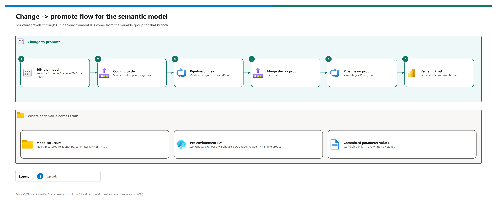

[README](../README.md) › [docs index](./00-reproduce-this-demo.md) › 09 Semantic model changes

# 09 - Changing and promoting the semantic model

<p>
&nbsp;
&nbsp;
&nbsp;
&nbsp;
&nbsp;

</p>

 

The day-2 runbook: how to change the Direct Lake on OneLake model (`Contoso-Sales-Model`) or the variable library and roll the change from `dev` to `prod` with the shipped pipeline. It covers where each value comes from, the standard flow, the common edits step by step, and the local checks to run before you push. Stage 3's internals are in [10 - Dynamic env injection](./10-dynamic-env-injection.md).

## At a glance

| | Concern | Source of truth | Why |
|---|---|---|---|
|  | Model structure - tables, measures, relationships, expression shape, parameter **names** | `fabric/Contoso-Sales-Model.SemanticModel/` in Git | Versioned, reviewable, replayable |
|  | Per-environment IDs - workspace, lakehouse, warehouse, SQL endpoint, label | `contoso-fabric-env-dev` / `-prod` | Central, Key Vault-backable, no Git churn |
|  | Committed parameter and value-set **values** | Scaffolding only | Overwritten per workspace by Stage 3 |

## Change -> promote flow

[](./assets/semantic-model-change-flow.png)

<sub>Editable source: [`assets/semantic-model-change-flow.drawio`](./assets/semantic-model-change-flow.drawio) - regenerate with `python scripts/export_diagrams.py docs/assets`.</sub>

| Step | | Action | Gate |
|---|---|---|---|
| **1** |  | Edit the model in the Dev workspace, or its TMDL in VS Code | ☐ Model opens without errors |
| **2** |  | Commit to `dev` (Source control pane, or `git push origin dev`) | ☐ Commit visible in Azure Repos |
| **3** |  | Pipeline on `dev`: Validate -> Sync -> Inject (Dev values) | ☐ Three stages green |
| **4** |  | PR `dev -> prod`, review, merge | ☐ Policy satisfied |
| **5** |  | Pipeline on `prod` with `contoso-fabric-env-prod` | ☐ Three stages green |
| **6** |  | Refresh a report in Prod; run [04 T4](./04-testing.md#t4---the-model-points-at-the-right-environment) | ☐ Prod data, Prod IDs |

> [!NOTE]
> No per-branch parameter editing is ever needed: both branches can carry identical `expressions.tmdl`, because Stage 3 owns the effective values in each workspace.

## Common operations

### Add a column to a table

1. Add the column to the warehouse table (`fabric/Contoso-Sales-WH.Warehouse/dbo/Tables/<table>.sql`) if the model reads it from there.
2. Add the `column` block to `fabric/Contoso-Sales-Model.SemanticModel/definition/tables/<table>.tmdl`.
3. Commit and push to `dev`; verify in Dev; promote.

### Add a table from the warehouse

1. Create `fabric/Contoso-Sales-WH.Warehouse/dbo/Tables/<name>.sql`.
2. Create `definition/tables/<name>.tmdl` mirroring `table1.tmdl`, with `expressionSource: 'DirectLake - Contoso-Sales-WH'`.
3. Add `ref table <name>` to `model.tmdl`. Stage 1 fails if the `expressionSource` doesn't exist in `expressions.tmdl`.

### Add a variable to the variable library

Four coordinated edits - miss one and Stage 3 silently leaves a stale value:

| # | | File / place | Edit |
|---|---|---|---|
| 1 |  | `fabric/Contoso_Vars.VariableLibrary/variables.json` | Add the variable (name, type, placeholder value) |
| 2 |  | `valueSets/Dev.json` and `valueSets/Prod.json` | Add it to `variableOverrides` |
| 3 |  | Both ADO variable groups | Add the real per-environment value |
| 4 |  | `scripts/inject_env_values.py` `overrides` map (+ an `INJECT_*` env var in the pipeline's Stage 3 `env:` block) | Map the group variable to the library variable |

Then document the new variable in [13 - Configuration reference](./13-configuration-reference.md); `tests/test_configuration.py` fails until you do.

> [!WARNING]
> Make the value-set edits in the Fabric portal first and let Fabric commit them, then adjust values in Git. Hand-authored value-set JSON triggered `DiscoverDependenciesFailed` on Git sync in the originating build ([05](./05-troubleshooting.md#variable-library-discoverdependenciesfailed)).

## Local checks before you push

```pwsh
# Stage 1, offline - exits 0 on success, 1 with a list of issues
$env:BUILD_SOURCEBRANCHNAME = "dev"
python scripts/validate_fabric_items.py

# Stage 3 helpers + offline guards
python tests/test_inject_helpers.py
python tests/test_scripts_offline.py
```

For a read-only rehearsal of Stage 3 against a real workspace, use the `DRY_RUN=1` block in [05 - Troubleshooting](./05-troubleshooting.md#stage-3---inject).

## Troubleshooting these changes

| Symptom | Cause | Fix |
|---|---|---|
| Stage 1: `missing expected M parameter WarehouseId` | Parameter line removed while editing | Restore `expression WarehouseId = "..." meta [...]` |
| Stage 1: `references expressionSource ... not defined` | New table points at a missing expression | Fix the name or add the expression |
| Stage 2: `Conflict` | Unsynced edits in the workspace | Commit or undo them, then re-run |
| Prod shows Dev data after a green run | Active value set or a variable missing from `overrides` | [05 quick triage](./05-troubleshooting.md#quick-triage) |

---

Next: [10 - Dynamic env injection](./10-dynamic-env-injection.md) →

*Last updated: 2026-10-07*
