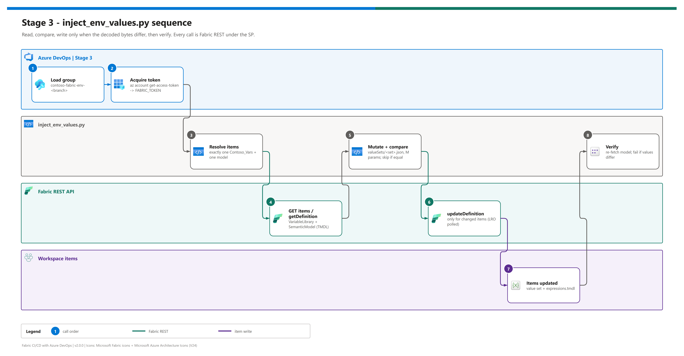

[README](../README.md) › [docs index](./00-reproduce-this-demo.md) › 10 Dynamic env injection

# 10 - Per-workspace value injection (Stage 3)

<p>
&nbsp;
&nbsp;
&nbsp;
&nbsp;
&nbsp;

</p>

  

The runbook for Stage 3 - how Azure DevOps variable groups and the Fabric REST API keep each workspace's variable library and Direct Lake model pointed at its own environment. It covers the one-time ADO setup (five items, each tied to a specific failure if skipped), what the script does call by call, a local dry run, verification queries, the design decisions, and every failure mode seen so far. Background on *why* this step exists: [06 - Direct Lake + variables](./06-direct-lake-variables.md).

## At a glance

| | Item | Value |
|---|---|---|
|  | Input | Variable group for the branch: `contoso-fabric-env-dev` or `contoso-fabric-env-prod` |
|  | Script | [`scripts/inject_env_values.py`](../scripts/inject_env_values.py) (only dependency: `requests`) |
|  | Writes | `valueSets/<set>.json` in `Contoso_Vars`; `WorkspaceId` / `LakehouseId` / `WarehouseId` in `Contoso-Sales-Model` |
|  | Safety | Exactly-one item match, exactly-one parameter match, compare before write, verify after write |

## Sequence

[](./assets/env-injection-sequence.png)

<sub>Editable source: [`assets/env-injection-sequence.drawio`](./assets/env-injection-sequence.drawio) - regenerate with `python scripts/export_diagrams.py docs/assets`.</sub>

## One-time setup

Five things must exist before the first push. Each maps to a row in the failure table at the bottom.

### 1. Create two ADO variable groups

Pipelines -> Library -> **+ Variable group**.

| Variable | `contoso-fabric-env-dev` example | Notes |
|---|---|---|
| `WORKSPACE_ID` | `11111111-1111-1111-1111-111111111111` | Dev workspace GUID |
| `LAKEHOUSE_ID` | `33333333-3333-3333-3333-333333333333` | Lakehouse item GUID |
| `WAREHOUSE_ID` | `55555555-5555-5555-5555-555555555555` | Warehouse item GUID |
| `WAREHOUSE_SQL_ENDPOINT` | `<dev-warehouse-sql>.datawarehouse.fabric.microsoft.com` | TDS endpoint |
| `ENVIRONMENT_LABEL` | `Dev` | Shown in reports / notebooks |
| `VALUE_SET` | `Dev` | **Must** equal the value-set name |
| `GIT_CONNECTION_ID` | Fabric connection GUID | Optional - enables the Stage 2 bind step |
| `VARIABLE_LIBRARY_NAME` / `SEMANTIC_MODEL_NAME` | `Contoso_Vars` / `Contoso-Sales-Model` | Optional - only when you rename the items |

`contoso-fabric-env-prod` has the same names with Prod values.

> [!TIP]
> Toggle **Link secrets from an Azure key vault** on either group if any value is sensitive. Linked and plain variables reach the script the same way.

### 2. Authorise the variable groups

Library -> each group -> **Pipeline permissions** -> add the pipeline. Without it the first run stops for an approval prompt.

### 3. Check the service connection

`fabric-cicd-sp` must be **Admin** (Learn's minimum for these calls is Contributor) on both workspaces and must have `myGitCredentials`, or Stage 2 never hands over to Stage 3. One-time setup: [11](./11-service-principal-fabric-git-setup.md).

### 4. Create the ADO environments

Each `deployment` job targets `fabric-$(Build.SourceBranchName)`. ADO creates a missing environment only if the build identity is an Environments administrator - usually it isn't - so create them up front: Pipelines -> **Environments** -> New environment -> `fabric-dev` (resource: None); repeat for `fabric-prod`. On each: **...** -> Security -> Pipeline permissions -> add the pipeline. Optional: **Approvals and checks** -> Approvals on `fabric-prod`.

```
Job sync_workspace: Environment fabric-prod could not be found.
The environment does not exist or has not been authorized for use.
```

### 5. Set the active value set in each workspace

Stage 3 updates value-set **contents**; which set is **active** is a per-workspace setting. Set it once: portal -> `Contoso_Vars` -> active value set -> `Dev` (Dev workspace) / `Prod` (Prod workspace), or via REST:

<details><summary><b>Show the REST call</b></summary>

```pwsh
$token = az account get-access-token --resource https://api.fabric.microsoft.com --query accessToken -o tsv
$body  = @{ properties = @{ activeValueSetName = "Prod" } } | ConvertTo-Json
Invoke-RestMethod -Method PATCH -ContentType 'application/json' -Body $body `
  -Headers @{ Authorization = "Bearer $token" } `
  -Uri "https://api.fabric.microsoft.com/v1/workspaces/<prod-ws-id>/variableLibraries/<varlib-id>"
```

[Update Variable Library](https://learn.microsoft.com/en-us/rest/api/fabric/variablelibrary/items/update-variable-library) - supports users, service principals and managed identities. Not yet automated in the pipeline (static-only here).

</details>

> [!NOTE]
> Earlier versions of this repo said no REST endpoint existed for the active value set. One does now; the portal step still works and remains the default in the runbooks.

## What the script does

| # | | Call | Behaviour |
|---|---|---|---|
| a |  | `GET /v1/workspaces/{ws}/items?type=VariableLibrary` | Exactly one `Contoso_Vars`, or fail |
| b |  | `GET /v1/workspaces/{ws}/items?type=SemanticModel` | Exactly one `Contoso-Sales-Model`, or fail |
| c |  | `POST .../items/{id}/getDefinition` -> edit `valueSets/<set>.json` -> `POST .../items/{id}/updateDefinition` | Each `variableOverrides[i].value` from the group; **skip** if unchanged |
| d |  | `POST .../semanticModels/{id}/getDefinition?format=TMDL` -> regex on `expressions.tmdl` -> `updateDefinition` | Each parameter must match exactly once; **skip** if unchanged |
| e |  | `getDefinition` again | Fail unless the new values are observable |

Exit codes: `0` success or no-op, `1` validation failure, `2` Fabric API failure. Every ID is redacted in logs.

## Local dry run

`DRY_RUN=1` performs every read and skips every write; the log shows what would change.

```pwsh
$env:FABRIC_TOKEN         = az account get-access-token --resource https://api.fabric.microsoft.com --query accessToken -o tsv
$env:FABRIC_WORKSPACE_ID  = "<dev workspace id>"
$env:INJECT_VALUE_SET     = "Dev";  $env:INJECT_ENV_LABEL = "Dev"
$env:INJECT_WORKSPACE_ID  = "<dev workspace id>"
$env:INJECT_LAKEHOUSE_ID  = "<dev lakehouse id>"
$env:INJECT_WAREHOUSE_ID  = "<dev warehouse id>"
$env:INJECT_WAREHOUSE_SQL = "<dev-warehouse-sql>.datawarehouse.fabric.microsoft.com"
$env:DRY_RUN              = "1"
python scripts/inject_env_values.py
```

## Verification queries

<details><summary><b>Show: did the value set change?</b></summary>

```pwsh
$token = az account get-access-token --resource https://api.fabric.microsoft.com --query accessToken -o tsv
$h     = @{ Authorization = "Bearer $token" }
$resp  = Invoke-RestMethod -Method POST -Headers $h `
         -Uri "https://api.fabric.microsoft.com/v1/workspaces/<ws-id>/items/<varlib-id>/getDefinition"
$part  = $resp.definition.parts | Where-Object path -like '*valueSets/Dev.json'
[Text.Encoding]::UTF8.GetString([Convert]::FromBase64String($part.payload))
```

</details>

The semantic-model check is [04 T4](./04-testing.md#t4---the-model-points-at-the-right-environment).

## Why this design

| Decision | Why |
|---|---|
| Variable groups own per-environment values, not Git | Central; Key Vault-backable; identical Git content on both branches |
| `updateDefinition` via REST after `updateFromGit` | Works for every item that exposes definitions; no deployment rules needed |
| Compare decoded content before writing | Fabric doesn't promise a no-op on identical input; avoids version churn |
| `semanticModels/{id}/getDefinition?format=TMDL` | Explicit format; cleaner than the generic item call for models |
| Variable group chosen with `${{ if }}` | Group authorisation is resolved at compile time |
| Token passed explicitly inside the same task | No reliance on credential discovery across task boundaries |
| Verify after writing the model | Regex rewrites of TMDL are fragile; prove the values stuck |
| Validator checks parameter **names**, not values | Committed values are scaffolding; a value cross-check would flag valid drift |

> [!IMPORTANT]
> Stage 3 overwrites whatever is committed. If you need to change an environment's IDs, change the **variable group** and re-run - never the TMDL.

## Failure modes and remediation

| Symptom | Cause | Fix |
|---|---|---|
| `InsufficientPrivileges` on `git/status` | Workspace role or tenant setting | [11](./11-service-principal-fabric-git-setup.md) steps 2-3 |
| `GitCredentialsNotConfigured` | No `myGitCredentials` | `GIT_CONNECTION_ID`, or [11](./11-service-principal-fabric-git-setup.md) steps 5-6 |
| `Environment fabric-<x> could not be found` | Setup step 4 skipped | Create + authorise the environment |
| `No VariableLibrary item named ...` | Item not synced yet, or renamed | Push once; set `VARIABLE_LIBRARY_NAME` |
| `Ambiguous match ...` | Duplicate items | Remove duplicates |
| `M parameter ... defined N times` | Hand-edited TMDL | Restore one definition per name |
| `Post-update verification failed` | Write accepted, value not observable | Re-run; then fix in the portal and raise a ticket |
| `403` on `updateDefinition` | SP role too low | Admin on the workspace |
| `401` | Token expired | Already mitigated: token acquired inside the Stage 3 task |
| Group not loaded | Setup step 2 skipped | Grant pipeline permission |
| Old values after a green run | Active value set, or variable missing from `overrides` | Setup step 5; [09](./09-semantic-model-deploy.md#add-a-variable-to-the-variable-library) |

---

Next: [11 - Service principal + Fabric Git setup](./11-service-principal-fabric-git-setup.md) →

*Last updated: 2026-10-07*
