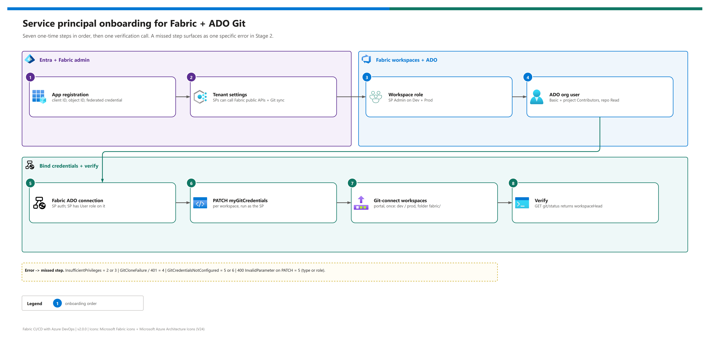

[README](../README.md) › [docs index](./00-reproduce-this-demo.md) › 11 Service principal + Fabric Git setup

# 11 - Service principal setup for Fabric + Azure DevOps Git

<p>
&nbsp;
&nbsp;
&nbsp;
&nbsp;
&nbsp;

</p>

  

The one-time onboarding runbook for the service principal that drives the pipeline. A user gets everything Fabric's Git calls need through an interactive portal handshake; a service principal gets none of it implicitly, so every prerequisite here is explicit. Run it once per service principal, per Fabric tenant, and per workspace the pipeline drives. Each skipped step shows up later as one specific error - the table at the bottom maps them back.

## At a glance

| | The pipeline calls, as the SP | Needs |
|---|---|---|
|  | `PATCH /v1/workspaces/{ws}/git/myGitCredentials` | Fabric ADO connection the SP can use |
|  | `GET /v1/workspaces/{ws}/git/status` | Tenant setting + workspace role |
|  | `POST /v1/workspaces/{ws}/git/updateFromGit` | All of the above + an ADO org seat |
|  | `GET /v1/operations/{id}` | Same identity that started the operation |

## Onboarding steps

[](./assets/service-principal-onboarding.png)

<sub>Editable source: [`assets/service-principal-onboarding.drawio`](./assets/service-principal-onboarding.drawio) - regenerate with `python scripts/export_diagrams.py docs/assets`.</sub>

Work in order; each step depends on the one before.

### 1. Entra app registration

| | Setting | Value |
|---|---|---|
|  | Tenant | Same tenant as Fabric and the ADO org |
|  | Record | Application (client) ID, object ID, tenant ID -> `demo-ids.local.json` |
|  | Credential | **Federated credential** created by the ADO service connection (workload identity federation) - recommended; a client secret works but must be rotated |
|  | API permissions | None - the token audience is `https://api.fabric.microsoft.com` |

> [!IMPORTANT]
> **Create the ADO service connection for this app registration.** Project settings -> Service connections -> New -> **Azure Resource Manager** -> **Workload identity federation**, using the app registration above ([connect to Azure](https://learn.microsoft.com/en-us/azure/devops/pipelines/library/connect-to-azure)). The pipeline YAML expects it to be named `fabric-cicd-sp`: either use that name, or use your own and change the `serviceConnection` variable in each pipeline YAML to match ([13](./13-configuration-reference.md#pipeline-variables---shipped-path)). The value is a compile-time literal, so it can't come from a variable group.

### 2. Fabric tenant settings

Fabric Admin portal -> Tenant settings; enable each and scope it to a security group containing the SP ([developer settings](https://learn.microsoft.com/en-us/fabric/admin/service-admin-portal-developer), [Git settings](https://learn.microsoft.com/en-us/fabric/admin/git-integration-admin-settings)).

| Setting | Section | Why | Status |
|---|---|---|---|
| Service principals can call Fabric public APIs | Developer settings | Without it every SP call is rejected at the tenant boundary |  |
| Users can synchronize workspace items with their Git repositories | Git integration | Gates `git/status` and `updateFromGit` - for SPs too, despite the name |  |
| Users can export items to Git repositories in other geographical locations | Git integration | Only if the ADO org's geography differs from the capacity's |  |
| Service principals can create workspaces, connections, and deployment pipelines | Developer settings | Only if the SP creates its own Fabric connection (step 5) or a Path 1 pipeline |  |

> [!NOTE]
> Older material calls the first setting *Service principals can use Fabric APIs*. Microsoft split it into the two Developer settings above; only *call Fabric public APIs* is needed for this pipeline.

### 3. Workspace role

Each workspace (`Contoso-Sales-Dev`, `Contoso-Sales-Prod`) -> **Manage access** -> add the SP -> **Admin**. Learn lists Contributor as the minimum for `updateFromGit` ([Update From Git](https://learn.microsoft.com/en-us/rest/api/fabric/core/git/update-from-git)); this repo uses Admin because that's what the originating build validated end to end. Try Contributor in your tenant and record the result in [04](./04-testing.md#live-validation).

### 4. Azure DevOps organisation user

Organization settings -> Users -> **Add users** -> the SP by app name -> access level **Basic** -> project **Contributors**. Confirm at least **Read** on the repo (Project settings -> Repositories -> Security). Fabric clones the repo *as the SP* inside `updateFromGit`, so this fails on the ADO side even when every Fabric step is right.

### 5. Fabric Azure DevOps source-control connection

| Step | | Action |
|---|---|---|
| 5.1 |  | Fabric portal -> Settings -> **Manage connections and gateways** -> Connections -> **+ New** |
| 5.2 |  | Type **Azure DevOps (source control)**; authentication **Service principal** (tenant ID, client ID, credential) |
| 5.3 |  | Save; copy the **connection ID** -> `GIT_CONNECTION_ID` in both variable groups |
| 5.4 |  | Connection -> **Manage users** -> give the SP the **User** role (the SP must be able to use its own connection) |

One connection serves every workspace.

### 6. Bind the connection as the SP's myGitCredentials

`myGitCredentials` is per (identity, workspace) and must be set **by the SP**. The pipeline already does this idempotently when `GIT_CONNECTION_ID` is set; to do it by hand, run as the SP:

<details><summary><b>Show the PowerShell</b></summary>

```pwsh
$ws   = "<workspace-guid>"
$conn = "<fabric-connection-guid>"
$token   = az account get-access-token --resource https://api.fabric.microsoft.com --query accessToken -o tsv
$headers = @{ Authorization = "Bearer $token"; 'Content-Type' = 'application/json' }
$body    = @{ source = "ConfiguredConnection"; connectionId = $conn } | ConvertTo-Json
Invoke-RestMethod -Method PATCH -Headers $headers -Body $body `
  -Uri "https://api.fabric.microsoft.com/v1/workspaces/$ws/git/myGitCredentials"
```

</details>

HTTP 200 echoes the bound source. Repeat per workspace. ([Update My Git Credentials](https://learn.microsoft.com/en-us/rest/api/fabric/core/git/update-my-git-credentials) - service principals are supported with `ConfiguredConnection`.)

### 7. Git-connect each workspace (portal, once)

`myGitCredentials` covers the identity, not the binding. A workspace Admin connects each workspace to org / project / repo / branch / folder `fabric/` (Workspace settings -> Git integration): `Contoso-Sales-Dev` <-> `dev`, `Contoso-Sales-Prod` <-> `prod`.

> [!WARNING]
> Log in to the right tenant before running anything as the SP or as yourself: `az login --tenant <TENANT_ID>` then `az account show`. A token minted in the wrong tenant produces the same `InsufficientPrivileges` as a missing role.

## Verification

Run as the SP (inside an `AzureCLI@2` task using the service connection, or `az login --service-principal ... --tenant <TENANT_ID>` locally):

```pwsh
$token = az account get-access-token --resource https://api.fabric.microsoft.com --query accessToken -o tsv
Invoke-RestMethod -Headers @{ Authorization = "Bearer $token" } `
  -Uri "https://api.fabric.microsoft.com/v1/workspaces/<ws-id>/git/status"
```

Expect JSON with `workspaceHead`, `remoteCommitHash` and `changes` for both workspaces.

## Troubleshooting

| Error body | Root cause | Fix (step) |
|---|---|---|
| `InsufficientPrivileges`, `relatedResource.resourceType = Workspace` | No workspace role, or tenant setting off / not scoped to the SP | 3, then 2 |
| `GitCredentialsNotConfigured` | No `myGitCredentials` for this workspace | 5 + 6 |
| `GitCloneFailure` / 401 from ADO inside `updateFromGit` | SP not an ADO org user, or no repo Read | 4 |
| `400 InvalidParameter` on the PATCH | Wrong connection ID or type, or no role on the connection | 5 |
| `PrincipalTypeNotSupported` (deployment pipelines) | Not a Git issue - see Path 1 caveats | [07](./07-cicd-paths-and-promotion.md#path-1---deployment-pipelines) |

> [!TIP]
> Set `GIT_CONNECTION_ID` in both variable groups. The pipeline's bind step then makes step 6 automatic and self-healing for any new workspace you add.

---

Next: [12 - Workshop walkthrough](./12-workshop-walkthrough.md) →

*Last updated: 2026-10-07*
