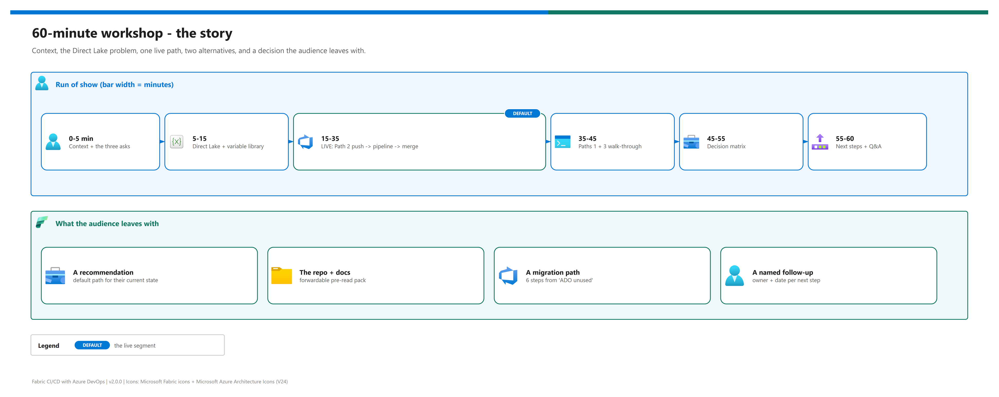

[README](../README.md) › [docs index](./00-reproduce-this-demo.md) › 12 Workshop walkthrough

# 12 - Workshop walkthrough (60 minutes)

&nbsp;
&nbsp;
&nbsp;
&nbsp;
&nbsp;

  

A ready-to-run, 60-minute customer workshop on Fabric CI/CD with Azure DevOps, for one presenter. It answers three questions most data teams bring: how to deploy a Direct Lake model whose source differs per environment, which of the three CI/CD paths fits them, and how to get from "ADO is connected but unused" to a working pipeline. The live segment uses Path 2; Paths 1 and 3 are walked through in code. This page is the presenter's script - the forwardable decision content is in [07](./07-cicd-paths-and-promotion.md) and [08](./08-ado-bridge-guidance.md).

## At a glance

| | Segment | Minutes | Mode |
|---|---|---|---|
|  | Context + the three asks | 0-5 | Slides |
|  | Direct Lake + variable library | 5-15 | Portal tour |
|  | **Live:** Path 2 push -> pipeline -> merge | 15-35 | VS Code + ADO + portal |
|  | Paths 1 + 3 code walk-through | 35-45 | VS Code, read-only |
|  | Decision matrix | 45-55 | Slide / [07](./07-cicd-paths-and-promotion.md#decision-matrix) |
|  | Migration path, next steps, Q&A | 55-60 | [08](./08-ado-bridge-guidance.md#recommended-next-steps-handout) |

## The story

Editable source: [`assets/workshop-walkthrough-story.drawio`](./assets/workshop-walkthrough-story.drawio) - regenerate with `python scripts/export_diagrams.py docs/assets`.

## Run of show

| Step | | Do | Expected result | Proof on screen |
|---|---|---|---|---|
| **1** |  | Restate their context and the three asks; agree the outcome | Shared problem statement | Agenda slide |
| **2** |  | Open `Contoso_Vars` in Dev; show variables and value sets; open the model's `expressions.tmdl` | They see why rules and `{{var}}` can't fix Direct Lake | Diagram in [06](./06-direct-lake-variables.md#how-it-works-in-this-repo) |
| **3** |  | In VS Code on `dev`, add a measure to `table1.tmdl`; commit + push | Pipeline queues | ADO Pipelines tab |
| **4** |  | Walk Stage 1 -> 2 -> 3 logs as they run | Three green stages | `synchronized to commit`, `verification passed` |
| **5** |  | Refresh the Dev workspace; show the new measure and the Dev IDs | Change live with Dev values | [04 T4](./04-testing.md#t4---the-model-points-at-the-right-environment) output |
| **6** |  | PR `dev -> prod`, approve, merge | Prod run; optional approval prompt | Prod model shows Prod IDs |
| **7** |  | Open `alternatives/deploy-via-deployment-pipeline.yml`; explain the item list and the SP caveat | Path 1 understood, limits clear | YAML header |
| **8** |  | Open `scripts/deploy_fabric_cicd.py` and `fabric/parameter.yml`; show `--dry-run` | Path 3 understood; same credential everywhere | `find_replace` tokens |
| **9** |  | Walk the decision matrix row by row; invite challenges | A recommended path for *their* state | [07 matrix](./07-cicd-paths-and-promotion.md#decision-matrix) |
| **10** |  | Show the 6-step migration path; assign owners and dates | Named follow-ups | [08 handout](./08-ado-bridge-guidance.md#recommended-next-steps-handout) |

> [!TIP]
> Frame the matrix with Microsoft's own words - *"many organizations take a hybrid approach"* - and the field observation that most of the work happens in Azure DevOps whichever path you pick. Teams relax once they see the paths combine.

> [!CAUTION]
> **Don't show** real tenant, workspace or connection IDs on screen (the logs redact them; your browser address bar doesn't), and don't run Path 1 or Path 3 live from this repo - they're static-only here. Don't promise that deployment rules will handle Direct Lake on OneLake models.

## Pre-flight (30 minutes before)

> [!IMPORTANT]
> Run a test push to `dev` the same day. Trials expire, capacities get paused and tenant policies unbind workspaces - you want to find out before the audience does.

- [ ] Capacity running (a trial expires after 60 days; a paid F-SKU may be paused)
- [ ] Both workspaces still on the capacity and Git-connected (`dev`, `prod`)
- [ ] A test push to `dev` ran green today; ADO hosted parallelism available
- [ ] Local clone on `dev`, `git status` clean, VS Code open
- [ ] Tabs: Dev workspace, Prod workspace, ADO repo, Pipelines, Branches, Environments
- [ ] Backup: screenshots or a recording of a green run and of T4 output
- [ ] `demo-ids.local.json` open on the presenter screen only

## Recovery plan

| If | | Then |
|---|---|---|
| Capacity expired or workspaces unbound |  | Switch to the recording; walk the YAML, scripts and diagrams - the workshop still lands |
| Pipeline stuck in queue |  | Click **Update all** in the Dev workspace by hand; explain what Stage 2 automates |
| A stage fails live |  | Use it: open [05](./05-troubleshooting.md#quick-triage), find the exact string, show the fix |
| Deep question outside scope |  | Capture it as a named follow-up with an owner and date |

## What the audience leaves with

| | Outcome |
|---|---|
|  | A recommendation for their current state (and permission to combine paths) |
|  | This repo + the pre-read pack: [01](./01-architecture.md), [06](./06-direct-lake-variables.md), [07](./07-cicd-paths-and-promotion.md), the [Microsoft tutorial](https://learn.microsoft.com/en-us/fabric/cicd/tutorial-fabric-cicd-azure-devops) |
|  | The 6-step migration path from "ADO connected but unused" |
|  | Confidence that Direct Lake models can follow each environment automatically |
|  | Named follow-ups with owners and dates |

> [!NOTE]
> The live segment has been run on Path 2 in the originating engagement (2026-05). Re-run the pre-flight in your own tenant before quoting it as live-tested there.

---

Next: [13 - Configuration reference](./13-configuration-reference.md) →

*Last updated: 2026-10-07*
