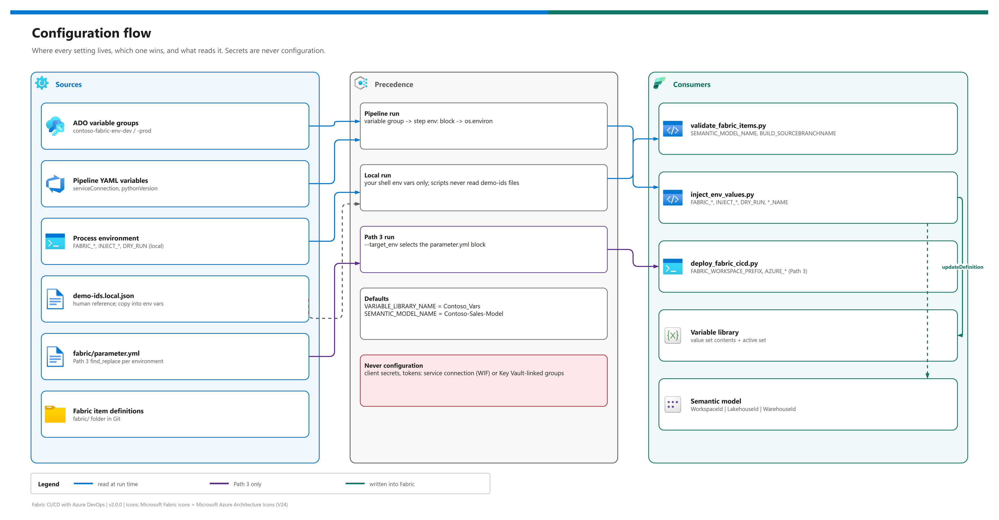

[README](../README.md) › [docs index](./00-reproduce-this-demo.md) › 13 Configuration reference

# 13 - Configuration reference

&nbsp;
&nbsp;
&nbsp;
&nbsp;
&nbsp;

  

Every value you can set in this pattern, on one page - so nobody has to read the YAML or the scripts to change a name, an ID or a behaviour. It shows where configuration lives, which source wins, each variable with its default and effect, and recipes for the common changes. `tests/test_configuration.py` fails when a script or pipeline reads something that isn't listed here.

## At a glance

| | Source | Holds | Read by |
|---|---|---|---|
|  | ADO variable groups | Per-environment IDs and names | Pipeline stages -> scripts |
|  | Pipeline YAML `variables:` | Service connection, Python version | The pipeline itself |
|  | Process environment | Everything a script reads | `scripts/*.py` |
|  | `demo-ids.local.json` | Your reference copy of IDs + the workload block | Humans only |
|  | `fabric/parameter.yml` | Path 3 replacements per environment | `fabric-cicd` |

## Configuration flow

Editable source: [`assets/configuration-flow.drawio`](./assets/configuration-flow.drawio) - regenerate with `python scripts/export_diagrams.py docs/assets`.

**Precedence.** In a pipeline run, a variable-group value reaches a script through the step's `env:` block (or ADO's automatic mapping of non-secret variables to environment variables); YAML defaults apply only where no group sets the name. In a local run, only your shell environment counts - scripts never read `demo-ids*.json`. Script defaults (below) apply when a variable is unset.

> [!IMPORTANT]
> **Never configuration:** client secrets, tokens and keys. The shipped pipeline uses the service connection (workload identity federation) and mints a token per task; Path 3 reads its secret from a Key Vault-linked group. Nothing secret belongs in YAML, `demo-ids*.json` or `parameter.yml`.

## Workload block (demo-ids.template.json)

The only domain-specific surface (hard rule: retargeting is configuration, not code). `tests/test_reusability_guards.py` keeps it in step with the items and code.

| Key | Default | Effect |
|---|---|---|
| `workspacePrefix` | `Contoso-Sales` | Workspace names `<prefix>-Dev` / `-Prod` (`-Test` for Path 3) |
| `environments` | `["dev", "prod"]` | Branches = environments; drives group names |
| `variableGroupPrefix` | `contoso-fabric-env-` | `<prefix><env>` group per branch |
| `adoEnvironmentPrefix` | `fabric-` | `<prefix><env>` ADO environment per branch |
| `serviceConnection` | `fabric-cicd-sp` | Must match the YAML `serviceConnection` |
| `items` | object | Display names of the four Fabric items |
| `lakehouse` | `Contoso_Sales_LH` | Lakehouse display name (also `parameter.yml`) |
| `warehouse` | `Contoso-Sales-WH` | Warehouse display name |
| `semanticModel` | `Contoso-Sales-Model` | Default for `SEMANTIC_MODEL_NAME` |
| `variableLibrary` | `Contoso_Vars` | Default for `VARIABLE_LIBRARY_NAME` |

## Pipeline variables - shipped path

| Variable | Where set | Default / example | Effect |
|---|---|---|---|
| `serviceConnection` | YAML | `fabric-cicd-sp` | ADO service connection for `AzureCLI@2`; compile-time literal |
| `pythonVersion` | YAML | `3.11` | Agent Python for Stages 1 and 3 |
| `contoso-fabric-env-dev` | Library | - | Group loaded for `dev` pushes (Stages 2-3) |
| `contoso-fabric-env-prod` | Library | - | Group loaded for `prod` pushes |
| `WORKSPACE_ID` | group | GUID | Target workspace for Stages 2-3 |
| `LAKEHOUSE_ID` | group | GUID | -> `INJECT_LAKEHOUSE_ID` |
| `WAREHOUSE_ID` | group | GUID | -> `INJECT_WAREHOUSE_ID` |
| `WAREHOUSE_SQL_ENDPOINT` | group | `<x>.datawarehouse.fabric.microsoft.com` | -> `INJECT_WAREHOUSE_SQL` |
| `ENVIRONMENT_LABEL` | group | `Dev` / `Prod` | -> `INJECT_ENV_LABEL` |
| `VALUE_SET` | group | `Dev` / `Prod` | -> `INJECT_VALUE_SET`; must equal the value-set name |
| `GIT_CONNECTION_ID` | group (optional) | GUID | Enables the idempotent `myGitCredentials` bind in Stage 2 |

## Pipeline variables - alternatives (opt-in)

| Variable | Pipeline | Effect |
|---|---|---|
| `contoso-fabric-dp` | Path 1 | Group holding the IDs below |
| `DEPLOYMENT_PIPELINE_ID` | Path 1 | Fabric deployment pipeline |
| `SOURCE_STAGE_ID` / `TARGET_STAGE_ID` | Path 1 | Stages to deploy between |
| `DP_LAKEHOUSE_ID` / `DP_VARIABLE_LIBRARY_ID` | Path 1 | Source-stage items to deploy |
| `fabric_cicd_group_sensitive` | Path 3 | Key Vault-linked group with `aztenantid`, `azclientid`, `azspnsecret` |
| `aztenantid` / `azclientid` / `azspnsecret` | Path 3 | -> `AZURE_TENANT_ID` / `AZURE_CLIENT_ID` / `AZURE_CLIENT_SECRET` |
| `fabric_cicd_group_non_sensitive` | Path 3 | Holds `FABRIC_WORKSPACE_PREFIX` |

## Script environment variables

| Variable | Script | Required | Default | Effect |
|---|---|---|---|---|
| `FABRIC_TOKEN` | `inject_env_values.py` | yes | - | Fabric bearer token (pipeline mints it in-task) |
| `FABRIC_WORKSPACE_ID` | `inject_env_values.py` | yes | - | Workspace to update |
| `INJECT_VALUE_SET` | `inject_env_values.py` | yes | - | Value set to rewrite |
| `INJECT_ENV_LABEL` | `inject_env_values.py` | yes | - | `environmentLabel` value |
| `INJECT_WORKSPACE_ID` | `inject_env_values.py` | yes | - | `workspaceId` + `WorkspaceId` M parameter |
| `INJECT_LAKEHOUSE_ID` | `inject_env_values.py` | yes | - | `lakehouseId` + `LakehouseId` M parameter |
| `INJECT_WAREHOUSE_ID` | `inject_env_values.py` | yes | - | `warehouseId` + `WarehouseId` M parameter |
| `INJECT_WAREHOUSE_SQL` | `inject_env_values.py` | yes | - | `warehouseSqlEndpoint` |
| `DRY_RUN` | `inject_env_values.py` | no | off | `1` = read everything, write nothing |
| `VARIABLE_LIBRARY_NAME` | `inject_env_values.py` | no | `Contoso_Vars` | Variable library display name |
| `SEMANTIC_MODEL_NAME` | `inject_env_values.py`, `validate_fabric_items.py` | no | `Contoso-Sales-Model` | Model display name / folder name |
| `BUILD_SOURCEBRANCHNAME` / `GIT_BRANCH` | `validate_fabric_items.py` | no | - | Branch shown in the validator summary |
| `FABRIC_WORKSPACE_PREFIX` | `deploy_fabric_cicd.py` | no | `Contoso-Sales` | Workspace `<prefix>-<Env>` resolved by name |
| `AZURE_TENANT_ID` / `AZURE_CLIENT_ID` / `AZURE_CLIENT_SECRET` | `deploy_fabric_cicd.py` | no | - | Client-secret auth when all three set; else `DefaultAzureCredential` |
| `DRAWIO_EXE` | `export_diagrams.py` | no | auto-detect | Path to the draw.io desktop executable |

> [!WARNING]
> Stage 1 doesn't load a variable group. If you rename the semantic model, also add `SEMANTIC_MODEL_NAME` to the YAML's top-level `variables:` so the validator looks in the right folder.

## Script arguments - Path 3

| Argument | Values | Default | Effect |
|---|---|---|---|
| `--target_env` | `dev`, `test`, `prod` | required | Selects the `parameter.yml` block and default workspace name |
| `--workspace_name` | any | `<prefix>-<Env>` | Overrides the derived name |
| `--items_in_scope` | JSON array | Lakehouse, Warehouse, SemanticModel, VariableLibrary | Item types to publish |
| `--mode` | `library`, `rest` | `library` | `fabric-cicd` publish, or REST list + `updateFromGit` |
| `--dry-run` | flag | off | Resolve and authenticate only |

## Values you capture

| Value | `demo-ids.local.json` key | Goes into |
|---|---|---|
| Workspace IDs | `workspaces.<env>.id` | `WORKSPACE_ID` |
| Lakehouse / warehouse IDs | `workspaces.<env>.lakehouseId` / `.warehouseId` | `LAKEHOUSE_ID` / `WAREHOUSE_ID` |
| SQL endpoint | `workspaces.<env>.warehouseSqlEndpoint` | `WAREHOUSE_SQL_ENDPOINT` |
| Fabric ADO connection ID | `fabricGitConnectionId` | `GIT_CONNECTION_ID` |
| Deployment pipeline + stage IDs | `optionalPaths.path1DeploymentPipeline.*` | Path 1 group |

## Recipes

| Goal | | Change |
|---|---|---|
| Retarget to another workload |  | Edit the workload block; rename item folders + `.platform` display names; update the YAML group names; run `tests/test_reusability_guards.py` ([01](./01-architecture.md#adapting-this-pattern-to-another-workload)) |
| Add a QA tier |  | Workspace + `qa` branch + `contoso-fabric-env-qa` + `fabric-qa`; add `qa` to `trigger`, `pr`, the `condition`s and a `${{ if }}` group block |
| Use your own service connection |  | Set `serviceConnection` in each YAML (and the workload block) |
| Hide IDs |  | Link the variable groups to Key Vault; no YAML change |
| Rehearse Stage 3 safely |  | Set the `INJECT_*` / `FABRIC_*` variables and `DRY_RUN=1` locally |
| Adopt Path 1 or Path 3 |  | Create its groups, register the YAML under `alternatives/`, then add a `trigger:` ([07](./07-cicd-paths-and-promotion.md)) |

> [!TIP]
> After adding any new variable, run `python tests/test_configuration.py`. It lists exactly what's missing from this page.

---

Next: [README](../README.md) →

*Last updated: 2026-10-07*
